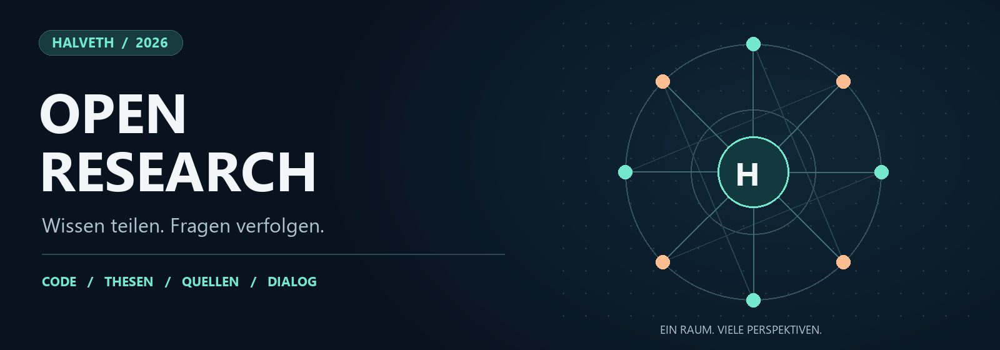

<p align="center">
  
</p>

# HALVETH · Open Research

**Ein offener Forschungsraum von Juri Janovski und den HALVETH Open Research contributors.**

Hier treffen Software, Naturbeobachtung, Sprache und gesellschaftliche Fragen aufeinander. Du kannst ein Modell ausprobieren, einen Bericht lesen, eine Quelle ergänzen oder mit einer eigenen Frage einsteigen. Die Sammlung wächst mit nachvollziehbaren Beiträgen.

**[Im Wiki starten](https://github.com/Juri-Halveth/open-research-branches/wiki)** · **[Alle Projekte](wiki/Projekte.md)** · **[Diskutieren](https://github.com/Juri-Halveth/open-research-branches/discussions)** · **[Nutzung & Credit](wiki/Rechte-und-Nutzung.md)**

---

## Finde dein Thema

| | |
| :--- | :--- |
| **💻 [Code & Werkzeuge](wiki/Code-und-Werkzeuge.md)**<br>Focus Kernel, Ja/Nein-Klärung, Referenzprüfung und wiederverwendbare Methoden. | **💧 [Licht, Wasser & Energie](wiki/Licht-Wasser-und-Energie.md)**<br>Optik, thermische Systeme, Quanteninternet und unterscheidbare Modelle. |
| **🧭 [Identität, Sprache & Medien](wiki/Identitaet-Sprache-und-Medien.md)**<br>ASTER, Secret Garden, Alice, Zeichen und die Bedeutung von Referenzen. | **🤝 [Gesellschaft, Teilhabe & Frieden](wiki/Gesellschaft-Teilhabe-und-Frieden.md)**<br>Zuhörräume, Beschäftigtenbeteiligung, Friedenskunst und öffentliche Informationen. |
| **🌱 [Natur & Beobachtung](wiki/Natur-und-Beobachtung.md)**<br>Pflanzen, Wahrnehmung, Protokolle und die Frage, was eine Beobachtung trägt. | **🎮 [Digitale Plattformen](wiki/Digitale-Plattformen.md)**<br>Steam, Wallets, Browser-Erweiterungen und transparente Produktfunktionen. |
| **🔭 [Thesen & Forschungsfragen](wiki/Thesen-und-Forschungsfragen.md)**<br>Offene Gedanken, Gegenmodelle und konkrete nächste Untersuchungen. | **🗂️ [Belege & Zeitlinien](wiki/Belege-und-Zeitlinien.md)**<br>Quellen, veröffentlichte Fassungen, Prioritätsfragen und nachvollziehbare Herkunft. |

**25 Forschungsäste** sind im [Projektverzeichnis](wiki/Projekte.md) einzeln beschrieben. Das [Glossar](wiki/Glossar.md) erklärt die Begriffe; der [Berichtsindex](reports/README.md) führt zu den öffentlichen Audits.

## Drei Wege zum Einstieg

| Ich möchte … | Starte hier | Was du findest |
| :--- | :--- | :--- |
| **lesen und verstehen** | [Wiki-Start](wiki/Home.md) | Kurze Themenübersichten mit Wegen zu Originaldateien und Quellen. |
| **etwas ausprobieren** | [Code & Werkzeuge](wiki/Code-und-Werkzeuge.md) | Kleine Prototypen, synthetische Beispiele und ausführbare Tests. |
| **mitdenken und beitragen** | [Mitmachen](wiki/Mitmachen.md) | Fragen, Quellenkorrekturen, eigene Ergebnisse und freiwillige Zusammenarbeit. |

## Einblicke in die Sammlung

**Staking: Wann sind Token wieder verfügbar?**

DAG, FET, ATOM, ETH und SOL im Quellenvergleich; bei DAG stehen 21 und 30 Tage in unterschiedlichen Dokumenten. [Zum neuen Bericht](reports/FREE_NEWS_021_STAKING_UNBONDING_AND_TRANSPARENCY.md) · [Zum Projekt](branches/staking-unbonding-transparency-review/README.md)

**Steam: Coins, Wallet & Markt**

Was sind Spielgegenstände, was ist Guthaben und was bedeutet Handelbarkeit? [Zum Audit](branches/steam-coins-wallet-and-leak-audit/README.md) · [Zum Bericht](reports/FREE_NEWS_020_STEAM_COINS_WALLET_AND_LEAK_AUDIT.md)

**Ein Empfang, der zuhört**

Ein Vorschlag für verantwortliche, zugängliche Zuhörräume in öffentlichen Einrichtungen. [Zum Projekt](branches/public-authority-entry-listening-room/README.md) · [Zum Bericht](reports/FREE_NEWS_018_PUBLIC_AUTHORITY_ENTRY_LISTENING_ROOM.md)

**Licht, Wasser und Wärme**

Dokumentierte Modellideen im Vergleich mit veröffentlichten technischen Komponenten. [Zum Audit](branches/solar-and-thermal-provenance-audit/README.md) · [Zu offenen Wasserfragen](branches/water-photonic-open-questions/README.md)

**ASTER & Secret Garden**

Eine offene Erzählwelt mit klar bezeichneten Projektkeimen und Quellenbezügen. [Die Sammlung erkunden](branches/aster-provenance-and-secret-garden/README.md)

## Ein Raum für offene Diskussion

Eine gute Frage ist ein Beitrag. Du brauchst keine fertige Theorie, um einzusteigen. Beschreibe, was dich interessiert, und verlinke das passende Projekt. Auch eine andere Erklärung oder eine kleine Korrektur kann weiterhelfen.

- **[Fragen stellen](https://github.com/Juri-Halveth/open-research-branches/discussions/categories/fragen)** — Verständnis, Begriffe und offene Verbindungen.
- **[Forschungsbeiträge teilen](https://github.com/Juri-Halveth/open-research-branches/discussions/categories/forschungsbeitraege)** — Modelle, Beobachtungen und nachvollziehbare Ergebnisse.
- **[Quellen korrigieren](https://github.com/Juri-Halveth/open-research-branches/discussions/categories/quellenkorrekturen)** — Ergänzungen, bessere Fundstellen und Gegenbelege.
- **[Zusammenarbeit vorschlagen](https://github.com/Juri-Halveth/open-research-branches/discussions/categories/zusammenarbeit)** — Gemeinsame Entwicklung und ausdrücklich vereinbarte Beteiligung.

Für konkrete Dateiänderungen gibt es [Issues mit Vorlagen](https://github.com/Juri-Halveth/open-research-branches/issues/new/choose) und [Pull Requests](https://github.com/Juri-Halveth/open-research-branches/pulls). Beiträge dürfen Deutsch oder Englisch sein. Respektiere Personen, formuliere Kritik am Inhalt und veröffentliche nur Daten, die du teilen darfst.

## Nutzung, Namen und Herkunft

**Du sollst erkennen können, was du verwenden darfst und wem du Credit gibst.** Die [leicht lesbare Nutzungsübersicht](wiki/Rechte-und-Nutzung.md) erklärt die bestehende [Lizenzkarte](LICENSES.md). Nenne beim Zitieren das konkrete Projekt, die verwendete Fassung und die dortige Urheberangabe. [CITATION.cff](CITATION.cff), [Git-Historie](https://github.com/Juri-Halveth/open-research-branches/commits/main/) und [Releases](https://github.com/Juri-Halveth/open-research-branches/releases) helfen dabei.

Eine zusätzliche Vergütung oder Erfolgsbeteiligung kann freiwillig für einen benannten Beitrag vereinbart werden. Die [Provenienz-Dokumentation](PROVENANCE.md) erklärt, wie Dateistände und Prüfsummen gebunden werden. [Belege & Zeitlinien](wiki/Belege-und-Zeitlinien.md) trennt Dokumentation, Prioritätsfrage und Rechtsanspruch.

**Freigabenübersicht mit Vorbehalt weiterer bestehender Rechte:** Die [Rechteklarstellung](RIGHTS-RESERVATION.md) hält fest, dass die Lizenzkarte kein abschließendes Rechteinventar ist und über wirksame Freigaben und Verzichte hinaus keinen zusätzlichen Rechteverzicht enthält. Sie erklärt auch die gesetzliche Urhebervermutung am konkreten Werk. Bestehende Nutzungsbedingungen bleiben maßgeblich.

## Weitere öffentliche Projekte

| Projekt | Einstieg |
| :--- | :--- |
| **Lernstudio** | [Offene Lernplattform und Lernprojekte](https://github.com/Juri-Halveth/lernstudio) |
| **HALVETH Tresor** | [Eigenständiges öffentliches Repository](https://github.com/Juri-Halveth/halveth-tresor) |
| **These zur Geburt** | [Forschungsfrage zur Geburtsumgebung](https://github.com/Juri-Halveth/juri-janovski-these-zur-geburt) |

Die Projekte haben eigene Fassungen und Lizenzangaben. Der [datierte Projekt-Snapshot](catalog/public-project-snapshot.json) dokumentiert die damalige Bestandsaufnahme.

<details>
<summary><strong>Technischer Bestandsindex, Tests und Veröffentlichungsumfang</strong></summary>

Mit Node.js ab Version 20:

```sh
npm test
npm run check:navigation
```

### Open Research Branches · Bestandsübersicht

Dieses Repository veröffentlicht kleine, eigenständig fortsetzbare
Forschungs- und Softwareäste. Jeder Ast enthält eine eng gebundene Frage,
synthetische oder öffentliche Beispiele, überprüfbare Tests und sichtbare
Unbekannte.

Öffentlicher Kontakt: [juri@halveth.de](mailto:juri@halveth.de)

Die Sammlung ist kein Abbild privater Archive. Sie besitzt eine neue
Git-Historie und enthält ausschließlich einzeln freigegebene Ableitungen.
Persönliche Rohgedanken, Chats, nicht ausdrücklich freigegebene Identitäten, Wallet- und Browserdaten,
Gesundheitsakten, Kundendaten, aktive Hauptprojekte sowie laufende oder private
Sicherheitsmeldungen gehören nicht hierher.

## Erste öffentliche Äste

| Ast | Form | Stand |
| --- | --- | --- |
| `focus-kernel` | lokaler Entscheidungsprototyp | reproduzierbarer M1-Stand, M2 offen |
| `document-issue-reference-verifier` | synthetischer Referenzprüfer | reproduzierbarer Ableger |
| `bounded-knowledge-reuse-inventory` | begrenztes Inventarverfahren | reproduzierbarer Ableger |
| `pixel-region-change-observer` | Offline-Vergleich synthetischer Pixelmatrizen | reproduzierbarer Ableger |
| `browser-extension-claim-reassessment` | Einzelprüfung von 19 öffentlich gemeldeten Erweiterungen | `FINITE_SNAPSHOT` |
| `water-photonic-open-questions` | Forschungsfragen | `FINITE_SNAPSHOT` |
| `plant-observation-protocol` | Beobachtungsprotokoll | `FINITE_SNAPSHOT` |
| `deidentified-self-observation-protocol` | Schema ohne Personen- oder Gesundheitsdaten | `FINITE_SNAPSHOT` |
| `visual-interpretation-boundary` | Beobachtung und Interpretation | `FINITE_SNAPSHOT` |
| `document-scanner-crypto-modernization` | Modernisierungsplan | `HOLD_IMPLEMENTATION` |
| `russia-ukraine-information-and-peace-audit` | Quellen-, Informations- und Friedensaudit mit `Was los?.`-Prüfkreis und Decision-Snapshot-Firewall | `FINITE_SNAPSHOT` |
| `aster-provenance-and-secret-garden` | ASTER-Provenienz, öffentliche Erzählwelt und minimale Projektkeime | `PUBLIC_DERIVATIVE` |
| `navier-stokes-credit-value-and-plagiarism-audit` | Beweis-, Prioritäts-, Datenzugriffs-, Credit- und Wertprüfung mit kurzer Vorlesefassung | `FINITE_SNAPSHOT` |
| `binary-inquiry-loop` | deterministische wechselseitige Ja/Nein-Klärung mit Rückkehr zur gebundenen Frage | `PUBLIC_DERIVATIVE` |
| `solar-and-thermal-provenance-audit` | Juris Zündungs-/Wasser-/Lichtmodell im Komponenten- und Zeitvergleich mit KIT und Standard Thermal | `FINITE_SNAPSHOT` |
| `wax-crayon-peace-helmet-audit` | Wachsmalstift-Friedenshelm, lokaler Belegstand, historischer Vergleich, iOS-Marker-Protokoll und sicherer Pilot | `FINITE_SNAPSHOT` |
| `quantum-internet-aster-mirror-audit` | internationaler Quanteninternet- sowie ASTER-/ASTAR-/ASTRA-Spiegelaudit | `FINITE_SNAPSHOT` |
| `historical-cipher-decoding-challenge` | historische Entschlüsselungs- und Reproduzierbarkeitsprüfung mit Rosetta-Kontrolle | `FINITE_SNAPSHOT` |
| `alice-media-referent-and-agency-audit` | endliche Alice-Kandidatenmenge, offizielle Storyquellen und reziproker Report-first-Prüfer für Aussagen, Belegzugang und Vergleichsreife | `FINITE_SNAPSHOT` |
| `fingertip-spark-esd-spacecraft-audit` | berichtete Fingerspitzen-Funken, sechs physikalische und optische Modelle, passive Beobachtung sowie eng gebundene ESD-Raumfahrtbrücke | `FINITE_SNAPSHOT` |
| `priority-evidence-and-regress-audit` | sieben getrennte Achsen für Snapshot, Öffentlichkeit, Kenntnis, Ableitung, Rechtsverletzung, Anspruch und Höhe | `FINITE_SNAPSHOT` |
| `public-authority-entry-listening-room` | Geburtsraum-Prinzip als verantwortlicher, reizarmer Empfangs- und Zuhörraum mit getrennter Sicherheitsfunktion und gegenläufigem Reparaturhaushalt | `FINITE_SNAPSHOT` |
| `xxxlutz-porta-takeover-and-employee-participation-audit` | angemeldete XXXLutz/porta-Übernahme, EU-Verfahrensstand, NRW-Standorte, Beschäftigtenrechte und freiwillige Beteiligungswege | `FINITE_SNAPSHOT` |
| `steam-coins-wallet-and-leak-audit` | Coins-Inventar, Wallet, Points, Bitcoin-Vergleich und getrennte Achievement-Leak-Quellenprüfung | `FINITE_SNAPSHOT` |

Der maschinenlesbare Bestand liegt in
[`catalog/branches.json`](catalog/branches.json). Die Aufnahme- und
Ausschlussregeln stehen in [`PUBLICATION_POLICY.md`](PUBLICATION_POLICY.md).
Die exakt veröffentlichte Dateimenge ist in
[`catalog/public-files.txt`](catalog/public-files.txt) positiv aufgelistet und
wird im Testlauf mit dem Git-Index verglichen.
Noch nicht quellgebundene Themenfamilien bleiben im
[`Kandidaten-Ledger`](catalog/CANDIDATE_TOPICS.md) sichtbar; sie werden nicht
als bereits geprüfte oder veröffentlichte Äste gezählt.

Der [`Audit Star`](catalog/AUDIT_STAR.md) erzeugt daraus einen deterministischen,
endlichen Index der aktuellen und historischen Git-Pfade. Seine Relationen
bedeuten ausschließlich Katalogaufnahme oder wörtlich belegte Querverweise;
sie leiten keine Kausalität, Urheberschaft oder Identität ab.

## Berichte und Arbeitsansichten

Der Ordner [`reports/`](reports/) enthält zusätzliche öffentliche
Quellenprüfungen. Lokal erzeugte Office- und PDF-Artefakte des früheren
Zehn-Ast-Arbeitsstands bleiben wegen Versions- und teils getrennter
Vorlagenrechte außerhalb des öffentlichen Repositorys. Für den
Wachsmalstift-Friedenshelm enthält der Ast dagegen eigene reproduzierbare
Buildquellen; die daraus erzeugten PDF- und Präsentationsdateien werden als
separat geprüfte Release-Assets verteilt. Der aktuelle Quellstand liegt in den
Astordnern und im maschinenlesbaren Katalog.

Der [`öffentliche Projekt-Snapshot`](reports/FREE_NEWS_016_PUBLIC_GITHUB_PROJECT_CONSTELLATION.md)
bindet außerdem die vier beim Abruf sichtbaren öffentlichen Repositorys dieses
Kontos. Die [`Marker-Matrix`](reports/FREE_NEWS_017_CE_BARCODES_HTTPS_500_AND_SNAPSHOT_MARKERS.md)
trennt CE, Strichcodes, HTTPS, HTTP 500, Git-, iOS-, Microsoft-PKI- und den noch
ungebundenen Frankfurt-Snapshot nach ihrer jeweils belegten Funktion.
[`FREE NEWS 018`](reports/FREE_NEWS_018_PUBLIC_AUTHORITY_ENTRY_LISTENING_ROOM.md)
und der zugehörige
[`Behördeneingangs-Ast`](branches/public-authority-entry-listening-room/README.md)
materialisieren Juris Geburtsraum-Prinzip als öffentlichen Vorschlag für einen
freiwilligen Zuhörraum, eine getrennte Sicherheitsfunktion und einen
datensparsamen Reparaturhaushalt.
[`FREE NEWS 019`](reports/FREE_NEWS_019_XXXLUTZ_PORTA_TAKEOVER_AND_EMPLOYEE_PARTICIPATION.md)
und der zugehörige
[`XXXLutz/porta-Ast`](branches/xxxlutz-porta-takeover-and-employee-participation-audit/README.md)
binden den aktuellen EU-Verfahrensstand an eine konkrete Beschäftigten-,
Informations-, Mitbestimmungs- und Beteiligungsroute.

[`FREE NEWS 020`](reports/FREE_NEWS_020_STEAM_COINS_WALLET_AND_LEAK_AUDIT.md)
und der [Steam-Coins-Ast](branches/steam-coins-wallet-and-leak-audit/README.md)
untersuchen digitale Sammelgegenstände, Guthaben, Liquidität und eine
verbraucherfreundliche Darstellung von Zufallskäufen.

## Mitmachen

Wähle einen Ast, lies dessen Grenzen und bearbeite eine der offenen Aufgaben.
Neue Beobachtungen müssen ihre Quelle und ihren Erfassungsumfang nennen.
Unbekannte Zustände bleiben `UNKNOWN`, bis eine passende Beobachtung sie
entscheidet. Pull Requests mit synthetischen Tests, Gegenhypothesen,
Reproduktionsschritten oder besseren Quellen sind willkommen.

## Lizenzen

- Code: generally [MIT](LICENSE), with the exact new provenance-tool exceptions listed in [`LICENSES.md`](LICENSES.md)
- neu verfasste Texte und eigene Abbildungen: [CC BY 4.0](LICENSE-CONTENT.md)
- selbst erstellte Daten und Metadaten gemäß Pfadkarte: [CC0 1.0](LICENSE-DATA.md)
- bezeichnete neue Forschungs- und Provenienzdateien: [Juri Public-Interest Research Permission 1.0](LICENSE-JURI-PUBLIC-INTEREST.md)

Die vollständige pfadbezogene Zuordnung steht in [`LICENSES.md`](LICENSES.md).

Diese Zuordnung erteilt keine Rechte an verlinkten oder zitierten Quellen.

## Reproduzierbarer Snapshot

[`CODE ZEITWÄRTSZURÜCK`](PROVENANCE.md) erzeugt für einen Release einen
maschinenlesbaren Umschlag aus Tag, Commit, Git-Tree, sichtbarer Historie,
Dateipfaden, Byteanzahlen, SHA-256-Digests und deklarierter Pfadlizenz. Damit
kann der veröffentlichte Code- und Textstand später bytegenau geprüft werden.
Der Nachweis ändert keine historischen Lizenzen und beansprucht keine Rechte
an fremden Quellen, Tatsachen oder allgemeinen Ideen.

</details>

---

**HALVETH Open Research** · Initiator: **Juri Janovski** · [Öffentlicher Kontakt](mailto:juri@halveth.de)
*Lesen. Nachfragen. Weiterdenken. Etwas beitragen.*
