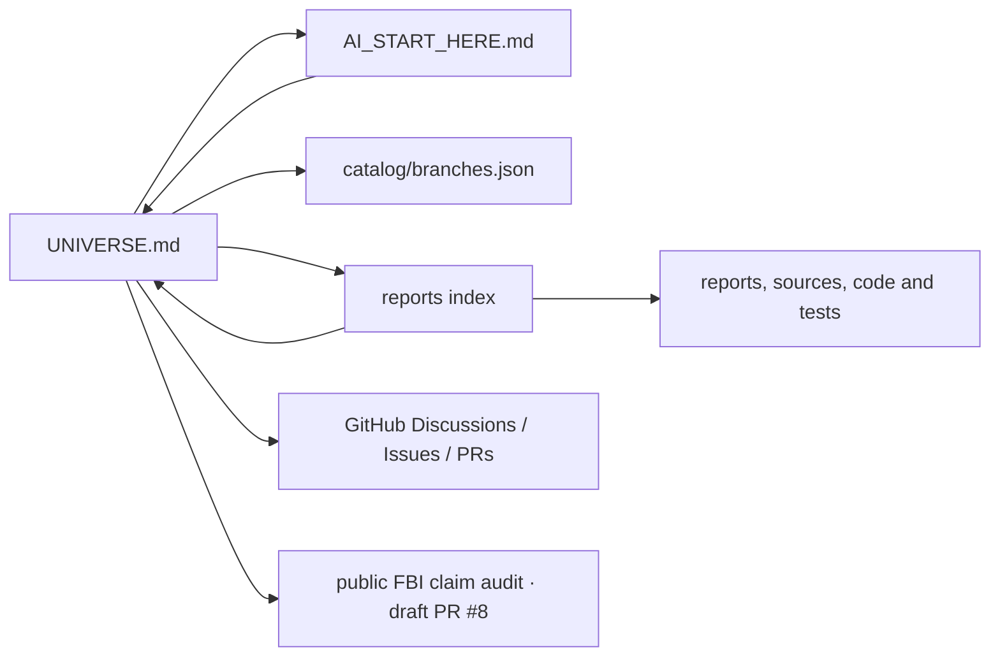

# HALVETH reference network / HALVETH-Verweisnetz

**Bound snapshot:** public `open-research-branches` commit `ed201d4f01afb2d2e27b74b309adfa4b8a27b13f`, read on 2026-09-23 at approximately 16:36 UTC. This is a finite syntax audit, not a claim about every HALVETH file, every service, or the whole web.

## Entry and return / Einstieg und Rückweg

Start at [UNIVERSE.md](UNIVERSE.md), pass through [AI_START_HERE.md](AI_START_HERE.md), then bind a particular [catalog entry](catalog/branches.json), file and commit. The [reports index](reports/README.md) links back to the Universe entry. The [FBI/ShinyHunters public source audit](https://github.com/Juri-Halveth/open-research-branches/pull/8) is a separate draft PR; its data and status must be read at its own head. A Discussion or PR adds a reviewable contribution route. These arrows mean *navigation*, not causation, authority, identity, independent corroboration or security protection.

## What the code checked / Was der Code geprüft hat

Run `node scripts/check-reference-network.mjs` in this repository. The script reads `git ls-files` at the checkout's `HEAD` and scans UTF-8 text candidates for lexical Markdown links, HTML `href`/`src` attributes and JavaScript module imports. It resolves relative destinations against tracked paths, distinguishes directory links, records missing local destinations and counts exact reciprocal source/target pairs. It does not open links, inspect private drives, execute scanned files, parse all programming languages, verify headings or assert that a backlink has the same meaning as a forward link. The pre-existing [Audit Star](catalog/AUDIT_STAR.md) is a separate path-and-history index fixed to its own older commit.

The pre-change run against the bound commit reported:

| Measure | Observed value |
| --- | ---: |
| Git-tracked files | 353 |
| UTF-8 text candidates read | 339 |
| Files with at least one extracted reference | 163 |
| Lexical references extracted | 1,700 |
| Relative targets resolved in the tracked tree | 654 (including 2 directory targets) |
| Missing relative targets under this parser | 0 |
| External, anchor-only, package or otherwise outside-local references | 1,046 |
| Exact reciprocal file/directory pairs | 45 |

Thus the check **does not show a reference in every file**. A file without one of these lexical forms is not automatically defective: a test, image, JSON receipt or source module may be reached through a catalog, manifest, import or README. A `0` in the missing-target column proves only that the parser found no missing destination inside its declared lexical coverage. It does not validate external URLs, anchor fragments, semantics, authorization or security. Re-run at a new commit and keep its output with the commit ID when those matters change.

## Reverse-time reading / Rückblickende Zeitfenster

The observation clock for these nested windows is **2026-09-23 16:36:26 UTC**. Git committer time orders the listed commits within this checkout; it is neither incident time nor independent authorship or publication proof.

| Window | Public Git observations in the checked two draft branches |
| --- | --- |
| 8 hours: 08:36:26–16:36:26 UTC | Universe PR #7 has four branch commits between 14:03 and 15:07 UTC. FBI PR #8 has three commits between 16:20 and 16:29 UTC. |
| 2 hours: 14:36:26–16:36:26 UTC | The PR #7 scientific-source clarification at 15:07 UTC and the three PR #8 commits fall in this window. The public Wiki/Gist entry update at 15:39 UTC is separately recorded in the local publication receipt. |
| 10 minutes: 16:26:26–16:36:26 UTC | PR #8's Reddit addendum at 16:27 UTC and wording clarification at 16:29 UTC are visible as commits. The graph checker was written and run locally during this interval; this document is its later review candidate. |

These windows cover the named branches and local graph run, not every chat, file edit, repository, website or historical source. The older FBI/Reacher analogy needs its original dated wording before it can be tested against the current incident. In particular, a previous reference to an FBI character in a TV analysis is not an observed 2026 intrusion.

## Relation contract / Relationsvertrag

For a new edge, record both endpoint paths and exact revisions, relation type (`LINKS_TO`, `IMPORTS`, `INDEXES`, `DISCUSSSES`, etc.), source span, observation time and evidence state. Treat `UNKNOWN` as a valid result. A hash binds bytes, and a cycle shows a return route; neither prevents tampering or supplies a physical mechanism. For an external security claim use the [private reporting route](SECURITY.md) and a scoped source/effect record. For public research, follow the [contribution guide](CONTRIBUTING.md).

**Claim ceiling:** `LEXICAL_REFERENCE_NETWORK_WITHIN_BOUND_PUBLIC_GIT_TREE_ONLY`.
