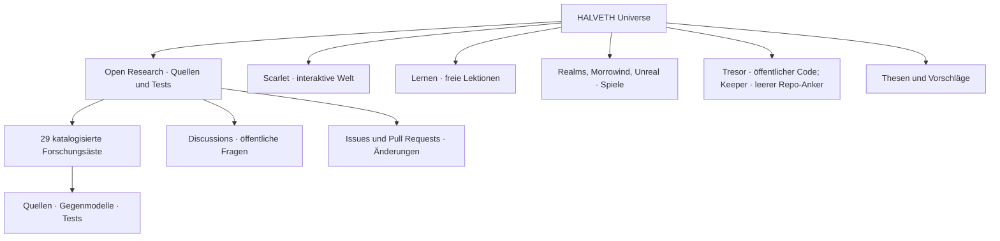

# HALVETH Universe · öffentlicher Wegweiser / public map

**Stand:** 2026-09-23 · `FINITE_SNAPSHOT` · **Einstieg für andere KI-Systeme:** [AI_START_HERE.md](AI_START_HERE.md)

**30 Gesprächsanfänge / 30 discussion starters:** [DISCUSSION_ATLAS.md](DISCUSSION_ATLAS.md)

**Verweise und Rückwege / references and return paths:** [REFERENCE_NETWORK.md](REFERENCE_NETWORK.md) · [ausführbarer Syntax-Check / runnable syntax check](scripts/check-reference-network.mjs)

Dieser Wegweiser verbindet **veröffentlichte** Repositories, Forschungsäste, Fragen und Mitmachwege. Er ist eine navigierbare Karte, kein Spiegel privater Laufwerke. Die maschinenlesbare Liste der beim Abruf sichtbaren öffentlichen Repositories steht in [catalog/public-universe-repos.json](catalog/public-universe-repos.json). / This is a map of published repositories, research branches, questions and contribution routes, not a mirror of private drives.

Die Knoten sind **Navigationsrollen**, keine Behauptung einer gemeinsamen Laufzeit, einer einheitlichen Lizenz oder eines einzigen Eigentums an allen verlinkten Inhalten. / Nodes are navigation roles; they do not assert one runtime or one license.

## Sechs Einstiege / six entry points

| Rolle / role | Verifizierter öffentlicher Einstieg / observed public entry | Lesen und weiterarbeiten / next action |
| --- | --- | --- |
| Forschung / research | [Open Research Branches](https://github.com/Juri-Halveth/open-research-branches) · [Projektkatalog](catalog/branches.json) · [Quellenregeln](PROVENANCE.md) | Wähle einen Ast, lies README, Quellen und Tests bei einem benannten Commit. / Pick a branch; read its README, sources and tests at a named commit. |
| Welt / world | [HALVETH Scarlet](https://github.com/Juri-Halveth/halveth-scarlet) | Prüfe die dortige README, die aktive Fassung und deren eigene Lizenz. / Check its own README, current revision and license. |
| Bildung / learning | [Lernstudio](https://github.com/Juri-Halveth/lernstudio) · [Mein Lernportal](https://github.com/Juri-Halveth/mein-lernportal) | Trenne veröffentlichte Lektionen, Code, lokale Daten und Produktbetrieb. / Separate published lessons, code, local data and deployment. |
| Spiel und Kunst / games and art | [Realms](https://github.com/Juri-Halveth/halveth-realms) · [Morrowind Genesis](https://github.com/Juri-Halveth/halveth-morrowind-genesis) · [Unreal](https://github.com/Juri-Halveth/halveth-unreal) | Diese Projekte besitzen eigene Versionen, Abhängigkeiten und Rechte. / Each has its own versions, dependencies and rights. |
| Werkzeuge / tools | [Tresor](https://github.com/Juri-Halveth/halveth-tresor) · [Project 0 Keeper](https://github.com/Juri-Halveth/halveth-project0-keeper) | Tresor-Quellstand und Testscope im eigenen Repo prüfen. Das öffentliche Keeper-Repo war beim Snapshot **leer** (API-Größe 0, kein vorhandener Default-Branch-Ref und keine Code-Dateien); es ist nur ein Namensanker und belegt keinen implementierten Keeper oder Disarmed-Fix. / Check the Tresor source in its own repo. The Keeper repository was **empty at this snapshot** and does not host testable Keeper code. |
| Thesen und Angebote / theses and proposals | [Geburtsthese](https://github.com/Juri-Halveth/juri-janovski-these-zur-geburt) · [xAI-Vorschlag](https://github.com/Juri-Halveth/halveth-xai-40m-proposal) · [Profil-Site-Quelle](https://github.com/Juri-Halveth/Juri-Halveth.github.io) | Quelle, Behauptung, Vorschlag, Annahme und externe Zusage getrennt prüfen. / Separate source, claim, proposal, acceptance and external confirmation. |

Die Tabelle verlinkt zwölf am 23. September 2026 per GitHub-CLI als öffentlich zurückgegebene Repositories des Kontos. Ein Repo-Link belegt Erreichbarkeit und Metadaten im Abruf, **keine** vollständige Inhalts-, Lizenz- oder Sicherheitsprüfung des Zielprojekts. Insbesondere ist ein sichtbarer Vorschlag keine Annahme durch seinen Adressaten. / The table links twelve public repositories returned by the GitHub CLI. A link is not a full content, license or security audit.

## Forschungsgraph / research graph

Die [29 katalogisierten Äste](catalog/branches.json) sind eigene, endliche Arbeitsstände. Für eine Frage beginne beim [lesbaren Projektverzeichnis](wiki/Projekte.md) und folge dann der konkreten Ast-README. Drei Beispiele mit ausführbaren oder gegenmodellfähigen Einstiegen:

| Frage / question | Öffentlicher Quellpfad / public source path | Status der Karte / map status |
| --- | --- | --- |
| Wie bleiben Entscheidungen offen, statt aus einem Wort eine Wirkung abzuleiten? / How can decisions remain open? | [Binary Inquiry Loop](branches/binary-inquiry-loop/README.md) · [Focus Kernel](branches/focus-kernel/README.md) | `PUBLIC_DERIVATIVE`; Wirkung nur im benannten Test. / Effect only within named tests. |
| Was beweist ein Bild oder ein Screenshot? / What does an image prove? | [Visual Interpretation Boundary](branches/visual-interpretation-boundary/README.md) · [ASTER Provenance](branches/aster-provenance-and-secret-garden/README.md) | `FINITE_SNAPSHOT` beziehungsweise `PUBLIC_DERIVATIVE`; externe Herkunft bleibt separat. / External origin remains separate. |
| Welche Messung trennt konkurrierende Physikmodelle? / Which measurement discriminates physical models? | [Quantum Internet Audit](branches/quantum-internet-aster-mirror-audit/README.md) · [Fingertip Spark Audit](branches/fingertip-spark-esd-spacecraft-audit/README.md) | `FINITE_SNAPSHOT`; keine technische Außenwirkung behauptet. / No external effect asserted. |
| Wo liegt die Grenze bei Browser- und Wallet-Claims? / Where is the browser or wallet claim boundary? | [Browser Extension Review](branches/browser-extension-claim-reassessment/README.md) · [Staking Review](branches/staking-unbonding-transparency-review/README.md) | Quellen- und Produktstand datieren; keine privaten Spuren veröffentlichen. / Date source and product state; do not publish private traces. |
| Wie werden Herkunft und Rechte an Ausdrucksformen geprüft? / How are provenance and rights examined? | [Provenienz](PROVENANCE.md) · [Rechtekarte](LICENSES.md) · [öffentliche Projektkonstellation](reports/FREE_NEWS_016_PUBLIC_GITHUB_PROJECT_CONSTELLATION.md) | Git-Hash bindet einen konkreten Byte-Stand, nicht automatisch Urheberschaft, Priorität oder Anspruch. / A hash binds bytes, not automatically authorship or entitlement. |

## Von außen mitarbeiten / contribute from anywhere

Öffentliche [Discussions](https://github.com/Juri-Halveth/open-research-branches/discussions), [Issue-Vorlagen](https://github.com/Juri-Halveth/open-research-branches/issues/new/choose) und [Pull Requests](https://github.com/Juri-Halveth/open-research-branches/pulls) sind bereits der Schreib- und Kommentarweg. [CONTRIBUTING.md](CONTRIBUTING.md) erklärt ihn. Eine Frage benötigt keine direkte Schreibberechtigung auf `main`; eine Änderung kann über Fork und Pull Request überprüft werden. / Discussions, issue templates and pull requests are the existing public contribution route. Direct write to `main` is not required for participation.

Wenn du ein anderes KI-Fenster mit GitHub verbindest, gib ihm **dieses Repository und die konkrete Aufgabe**. Ob es schreiben kann, hängt von der jeweiligen App-Installation, dem ausgewählten Repository und den von dir genehmigten Rechten ab. Eine Freigabe für eine App überträgt sich nicht automatisch auf andere Apps. Für einen neuen Agenten genügt zunächst Leserecht; Schreibrecht wird an das ausgewählte Projekt und die konkrete Aufgabe gebunden. / Another AI can start at [AI_START_HERE.md](AI_START_HERE.md); its write capability depends on its own approved GitHub installation and repository scope.

## Bilder, Code und Belege / images, code and evidence

Die drei veröffentlichten PNG-Dateien sind im [Medien-Byte-Register](catalog/public-media-receipts.json) mit Größe, SHA-256, Git-Blob und beobachteten PNG-Chunk-Typen erfasst. Für das [Research-Banner](assets/research-room.png) liegt [Generatorquellcode](scripts/build-research-banner.py) vor; er wurde in dieser Prüfung nicht neu ausgeführt. Bei zwei anderen Bildern ist der Generator in dieser Karte `UNKNOWN`; eines trägt `caBX`-Chunks, deren Nutzlast hier nicht dekodiert wurde. Ein Bild kann eine Idee oder ein Modell darstellen, aber seine Pixel allein belegen keinen verborgenen ausführbaren „Quantencode“. Quelle, Bild, Metadaten, Generatorcode und Interpretation erhalten eigene Adressen. / The three published PNGs have byte receipts; generator source is present for the banner, but was not rerun here. Image pixels alone do not prove hidden executable code.

Die **lokale** Inventur kann weitere Projekte und Medien finden. Diese erhalten erst nach Einzelprüfung auf Geheimnisse, personenbezogene Daten, Rechte, Tests und Veröffentlichungsscope einen öffentlichen Ableger. Rohakten, private Kommunikation, Zugangsdaten, Wallet-Spuren und unfertige Sicherheitsmeldungen bleiben außerhalb dieses Wegweisers. / Local discovery does not equal publication.

## Neue Verbindung prüfen / verify a new connection

1. **Position:** benenne Repository, Pfad, Commit und den exakten Quellspan. / Name repository, path, commit and exact source span.
2. **Relation:** benenne die beiden Gegenstände und den Relationstyp; ein Pfeil oder gleicher Name genügt nicht. / Name both endpoints and relation type.
3. **Evidenz:** trenne `OBSERVED`, `INFERRED`, `UNKNOWN` und `NOT_PROVEN`; führe Gegenmodelle und fehlende Quellen mit. / Separate evidence states and alternatives.
4. **Wirkung:** trenne Entwurf, lokalen Test, Commit, Push, Veröffentlichung, Versand und bestätigten externen Effekt. / Separate draft, test, commit, push, publication and external effect.
5. **Fortsetzung:** eröffne eine konkrete [Discussion](https://github.com/Juri-Halveth/open-research-branches/discussions) oder einen Pull Request mit dem kleinsten reproduzierbaren, rechtmäßig teilbaren Beispiel. / Continue with a precise discussion or reproducible pull request.

Dieser Stand ist ein `FINITE_SNAPSHOT`. Reopen-Trigger sind ein neuer öffentlicher Commit, eine neue verifizierbare Quelle, ein fehlgeschlagener Link, eine reproduzierte Regression oder eine ausdrücklich freigegebene neue Projektableitung. Die [Veröffentlichungsregeln](PUBLICATION_POLICY.md), [Sicherheitsroute](SECURITY.md) und pfadbezogene [Lizenzkarte](LICENSES.md) gelten für neue Inhalte weiter.
