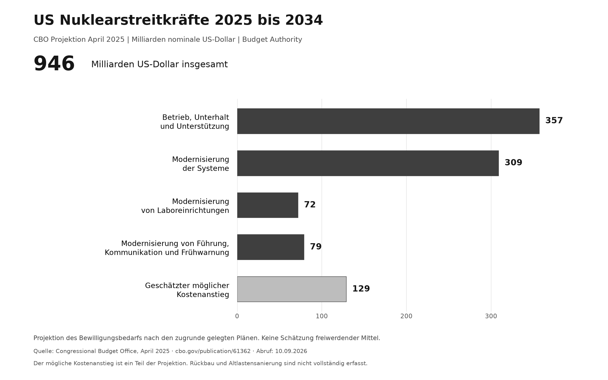

# Atomwaffen Macht und Geld

**Militärische Sicherheit und Währungspolitik sind historisch verbunden.** Der Blessing-Brief von 1967, Forschung über Atomwaffen als Machtressource und Studien zu Reservewährungen liefern konkrete Ansatzpunkte. Dieses Projekt verbindet sie mit Fallout, Entschädigungsprogrammen, Abrüstung, SUNDIAL und zivilen Budgetalternativen.

Herausgegeben von **Juri Janovski (@Juri-Halveth)** im HALVETH Open Research Forschungsraum. Redaktion und Aufbereitung mit KI-Unterstützung. Quellenstand **10. September 2026**.

**[Den vollständigen Bericht lesen](../../reports/FREE_NEWS_022_NUCLEAR_LEGACY_POWER_AND_PUBLIC_VALUE.md)** · **[Quellenregister](sources.json)** · **[Befunde und offene Fragen](claims.json)** · **[Themenübersicht](research-map.json)**

## Die wichtigsten Verbindungen

| Thema | Konkreter Einstieg |
| --- | --- |
| Militärfinanzierung und Dollarreserven | Blessings Schreiben vom 30. März 1967 behandelt US-Truppenausgaben, deutsche Rüstungskäufe und den Verzicht auf Dollarumtausch in US-Gold. |
| Atomwaffen als Machtressource | Anne Harrington de Santana untersucht 2009 Atomwaffen als gesellschaftlich zugeschriebene „Währung der Macht“. |
| Bündnisse und Währungen | Eine historische Studie von Eichengreen, Mehl und Chițu untersucht 19 Länder vor dem Ersten Weltkrieg. |
| Gesundheit und Umwelt | UNSCEAR, RERF, CDC und IAEA dokumentieren unterschiedlich verteilte Expositionen und Folgen. |
| Entschädigung und Unterstützung | Japan, US-RECA, Marshallinseln und Frankreich im Vergleich; Programmregeln, Bewilligungen und Auszahlungen bleiben unterscheidbar. |
| SUNDIAL und Abrüstung | Historische AEC-Archivspur von 1954, Testverbot, dokumentierte Demontage und zivile Konversion. |

Der Bericht verlinkt die jeweiligen Originale und erläutert ihren Aussageumfang. Eine politische Machtwährung, eine Zentralbankreserve und eine Bewertung statistischer Risikoreduktion bezeichnen unterschiedliche Verfahren. Die geprüften Quellen liefern keine allgemeine Umrechnungstabelle von Menschen oder Banknoten in Atombomben.

## Budgetentscheidungen sichtbar machen



Die Abbildung zeigt die **CBO-Projektion vom April 2025** für die **Haushaltsjahre 2025 bis 2034** in **Milliarden nominalen US-Dollar**. Die 946 Milliarden sind ein projiziertes Bewilligungsvolumen. Ein tatsächlich umsteuerbarer Betrag hängt von politischen Entscheidungen, Übergang und Sanierung ab. [CBO-Originalquelle](https://www.cbo.gov/publication/61362)

Der offene [Budgetrechner](budget-model.mjs) untersucht eine klar bezeichnete Annahme:

```js
import { calculateBudgetScenario } from './budget-model.mjs';

calculateBudgetScenario({
  baseline: 100,
  reallocationShare: 0.2,
  transitionCosts: 3,
  remediationCosts: 2,
  weights: { health: 0.5, environment: 0.3, research: 0.2 }
});
```

Das synthetische Beispiel ergibt Brutto 20, Kosten 5 und Netto 15. Steigen die Kosten auf 25, bleibt Netto −5 als Defizit sichtbar. Alle Eingaben gehören zur selben gewählten Budgeteinheit. [Offizielle Daten und synthetisches Beispiel](model-data.json) sind getrennt gespeichert.

Mit Node.js ab Version 20:

```sh
node --test branches/nuclear-legacy-disarmament-and-public-value/budget-model.test.mjs
```

Die Tests prüfen Rechenregeln und ungültige Eingaben. Der Rechner enthält keine Waffen-, Explosions-, Schadens- oder Auszahlungsberechnung.

## Gemeinsam weiterforschen

Ergänzungen sind besonders hilfreich, wenn sie ein benanntes Originaldokument, eine überprüfbare Fundstelle oder eine andere Erklärung mit unterscheidbarer Vorhersage enthalten. Archivkorrespondenz zu weiteren Staaten, zusätzliche Entschädigungsprogramme und dokumentierte Perspektiven betroffener Gemeinschaften können die Übersicht erweitern.

**[Forschungsbeiträge diskutieren](https://github.com/Juri-Halveth/open-research-branches/discussions/categories/forschungsbeitraege)** · **[Quellenkorrekturen](https://github.com/Juri-Halveth/open-research-branches/discussions/categories/quellenkorrekturen)**

Der Forschungsstand ist eine endliche Übersicht mit sichtbaren Fortsetzungsanlässen. [Lizenzkarte](../../LICENSES.md), [Credit](../../CITATION.cff) und [Provenienz](../../PROVENANCE.md) binden die veröffentlichten Fassungen. Verlinkte Fremdquellen behalten ihre jeweiligen Rechte und Urheberschaften.
