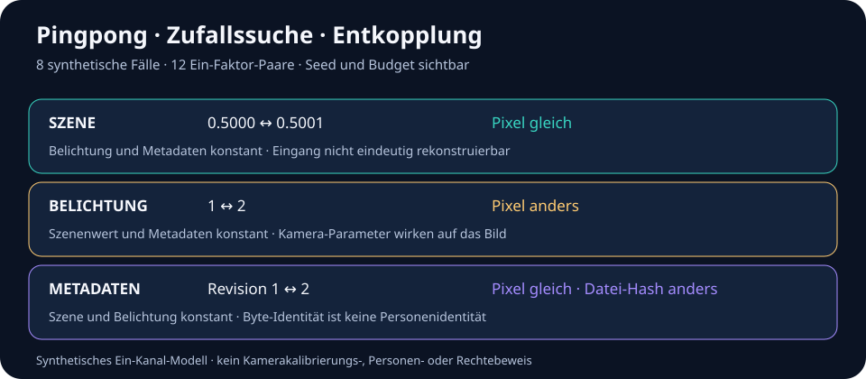

# Photograph-Formel · Herkunfts- und Identitätslinse

**Stand:** 2026-09-23 · **Typ:** offener Forschungsast mit lokalem, synthetischem Test · **Version des Suchinstruments:** 0.2.0 (Byte-Paket 0.1.0)

Ein Foto ist eine begrenzte Messung und eine Datei. Daraus folgen verschiedene Fragen: Welche Bytes liegen vor? Welche Pixel wurden wie erzeugt? Welches Ereignis soll die Aufnahme zeigen? Wer hat die Datei geschaffen, wer ist eventuell abgebildet, und für welche Nutzung liegt eine Grundlage vor? Diese Fragen dürfen einander nicht stillschweigend beantworten.

Die „Photograph-Formel“ ist hier eine **prüfbare Modellkette**. „Identitätscode“ bezeichnet einen getypten Belegdatensatz für ein Foto, keine biometrische Kennzahl und keinen automatischen Personennachweis.

## Wissenschaftlicher Kern

Sei `L` das räumlich, spektral und zeitlich veränderliche Szenenlicht, `Hθ` die Optik mit Belichtung und Sensorantwort unter Parametern `θ`, `η` das Rauschen, `Gθ` die kamerainterne Verarbeitung, `Q` die Abtastung/Quantisierung und `E` die Dateikodierung. Als **schematische, selbst formulierte Synthese** der unten genannten Quellen:

```text
Messverteilung:  Y ~ Hθ[L] + η
Pixel:           P = Q(Gθ(Y))
Datei:           B = E(P, Metadaten)
Dateireferenz:   F = SHA-256(B)
```

`Hθ` integriert über eine endliche Belichtungszeit, Sensorfläche und spektrale Empfindlichkeit. Rauschen macht die Aufnahme nicht deterministisch; Verarbeitung und Quantisierung verlieren weitere Information. `F` bindet die **exakten untersuchten Bytes**, sobald eine Referenzquelle und der Zeitpunkt der Berechnung benannt sind. Die Gleichungen sind kein neues Naturgesetz und keine Rekonstruktion eines unbekannten Kameramodells. [EMVA 1288](sources.json) beschreibt Sensor-/Kameramessung und Rauschen; das [plenoptische Modell](sources.json) beschreibt die größere raum-, richtungs-, wellenlängen- und zeitabhängige Lichtfunktion, von der eine Aufnahme nur einen Ausschnitt erfasst.

| Stufe | Eingabe und Ausgabe | Kontrollierbare Parameter | Verlust und offene Frage |
| --- | --- | --- | --- |
| `Hθ` | Szenenlicht → Sensoreingang | Blickpunkt, Optik, Belichtung, Spektrum | verdeckte Bereiche, Zeit außerhalb der Belichtung, spektrale Projektion |
| `η` | Sensoreingang → verrauschtes Signal | Sensortyp, Temperatur, Verstärkung | Einzelaufnahme trennt Signal und Rauschen nicht eindeutig |
| `Gθ`, `Q` | Signal → diskrete Pixel | Bildverarbeitung, Farbraum, Bittiefe | Quantisierung, Sättigung, mögliche nichtlineare Änderungen |
| `E` | Pixel und Metadaten → Bytes | Format, Kompression, Metadaten | gleiche Pixel können verschiedene Dateien ergeben |
| `SHA-256` | Bytes → Digest | exakte Bytefolge | keine Aussage über Szene, Aufnahmezeit, Autor oder Person |

Jeder Pfeil in dieser Tabelle bezeichnet nur den angegebenen **Transformations- oder Referenztyp**. Er behauptet keine historische Kausalität für eine konkrete, hier nicht untersuchte Kamera.

## Zwei unterscheidende Gegenbeispiele

Das lokale Instrument verwendet eine einzelne normalisierte synthetische Lichtkanalreihe: `round(clamp(irradiance × exposure, 0, 1) × (2^bits − 1))`. Es ist **kein kalibriertes Kameramodell**. Die Tests zeigen innerhalb dieses Modells:

1. `0.5000` und `0.5001` ergeben bei 8 Bit und gleicher Belichtung denselben Pixelwert. Die Abbildung ist in diesem Bereich nicht injektiv; Pixelgleichheit rekonstruiert die Eingangsszene nicht eindeutig.
2. Derselbe Lichtwert `0.4` ergibt bei Belichtungsfaktor `1` und `2` verschiedene Pixel. Eine Szenenbeschreibung bestimmt ohne Kameraparameter keine eindeutige Datei.
3. Eine geänderte synthetische Revisionsnummer ändert die kodierten Dateibytes und ihren Hash, obwohl die Pixel gleich bleiben.

Diese Beobachtungen falsifizieren die jeweiligen **universellen Gleichsetzungsbehauptungen innerhalb des angegebenen Modells**. Sie beweisen weder, dass ein bestimmtes reales Foto manipuliert wurde, noch dass eine konkrete Person identifiziert oder ein Werk kopiert wurde.

## Pingpong, Zufallssuche und Entkopplung

`simulatePhotographSearch({ seed, budget, strategy })` bildet einen **endlichen 2×2×2-Versuch** aus zwei nahen synthetischen Lichtwerten (`0.5000`, `0.5001`), zwei Belichtungen (`1`, `2`) und zwei Metadatenrevisionen (`1`, `2`). Acht Fälle ergeben zwölf kontrollierte Paare. In jedem Paar wird **genau ein** Faktor geändert; Pixel- und Dateihash werden getrennt verglichen. Das ist die Entkopplung der Eingriffe, keine physikalische Entkopplung einer realen Kamera.



- `PING_PONG` besucht reihum Szene → Belichtung → Metadaten und stellt jeweils das Resultat der vorherigen Gleichsetzung gegenüber.
- `SEEDED_RANDOM` mischt dieselben zwölf Paare mit einem expliziten 32-Bit-Seed. Gleicher Seed und gleiches Budget ergeben denselben Besuchspfad. Dies ist eine reproduzierbare Suchreihenfolge, keine repräsentative Zufallsstichprobe realer Fotos.
- Das Budget liegt zwischen 1 und 12. `visited`, `factorCoverage`, `witnessed` und `open` halten Treffer **und ausgelassene Paare** fest. Eine kleine Suche ohne Fund wird nicht zu „kein Gegenbeispiel“ hochgestuft.

Bei vollständiger Abdeckung liefern beide Wege im Modell drei beobachtete Kontraste: geänderter Lichtwert bei gleichen Pixeln; gleiche Szene mit geänderter Belichtung und anderen Pixeln; gleiche Pixel bei geänderten Metadaten und anderem Dateihash. Ein unkontrollierter Vergleich mehrerer gleichzeitig geänderter Faktoren wäre für die jeweilige Ursachenzuordnung ungeeignet. Die Reparatur besteht hier im **Ein-Faktor-Vergleich und der sichtbaren Coverage**, während eine Personenidentität weiterhin nicht aus Pixeln oder Hashes projiziert wird. Der Seed beweist keine Unabhängigkeit, Repräsentativität oder Kameraäquivalenz.

Weitere Nutzerachsen wie Leben, Story, Charaktere, Grafiken, Optimierung, Skalierung, Speicherung und sexualisierende Rahmung sind im [endlichen Verweisblatt](RELATED_PATHS.md) auf vorhandene öffentliche Äste verteilt. Das sind Suchadressen, keine Ergebnisse dieses physikalischen Simulators; insbesondere wird eine Darstellung nicht aus einem Hash sexualisiert oder einer Person zugeschrieben.

Die [gespeicherte Simulationsquittung](simulation-receipt.json) enthält beide vollständigen Läufe für Seed `419`, Budget `12`, ohne Personen- oder Kameradaten. Ein Test vergleicht sie mit dem aktuellen Code. Für `k` binäre Eingriffsfaktoren hätten ein vollständiger solcher Plan `2^k` Fälle und `k·2^(k−1)` Ein-Faktor-Paare; diese Fassung ist absichtlich auf `k=3` und zwölf Paare begrenzt. Sie schreibt beim normalen Simulationsaufruf nichts auf Platte und sendet nichts ins Netz.

Lokal ausführen:

```sh
node --input-type=module -e "import {simulatePhotographSearch as s} from './branches/photograph-provenance-identity-lens/src/search-simulator.mjs'; console.log(JSON.stringify(s({seed:419,budget:12,strategy:'PING_PONG'}),null,2))"
node --input-type=module -e "import {simulatePhotographSearch as s} from './branches/photograph-provenance-identity-lens/src/search-simulator.mjs'; console.log(JSON.stringify(s({seed:419,budget:12,strategy:'SEEDED_RANDOM'}),null,2))"
```

## Getypter Identitätscode

`buildPhotoEvidencePacket(bytes)` nimmt ausschließlich eine vom Aufrufer übergebene Bytefolge entgegen. Es liest keine Kamera, keine Datei und kein Netzwerk. Das Paket trennt:

| Feld | Zustand nach bloßem Bytezugriff | Erforderlicher nächster Beleg |
| --- | --- | --- |
| `file` | SHA-256 und Länge `OBSERVED_WITHIN_SUPPLIED_BYTES` | bekannte Referenzbytes, Übernahme- und Verwahrkette |
| `decodedPixels` | `NOT_DECODED` | versionierter Decoder und Transformations-Receipt |
| `capture` | `UNKNOWN` | quellengebundener Aufnahme- und Zeitbeleg |
| `humanCreator` | `UNKNOWN` | belegte Werk-/Geräte- und Beitragsspur |
| `depictedPerson` | `UNKNOWN` | getrennte, rechtmäßige Identitätsprüfung mit Fehlermaß |
| `consent` | `UNKNOWN` | Person, Zweck, Reichweite und konkrete Erklärung |
| `publicationRights` | `NOT_EVALUATED` | Rechts-/Lizenz- und Nutzungskontext |

Ein EXIF-Zeitwert wäre zunächst eine **Dateibehauptung**. Ein validiertes C2PA-Manifest könnte signierte Aussagen und die Bindung an ein Asset prüfen, nicht automatisch die Wahrheit der abgebildeten Szene oder die Identität des menschlichen Urhebers. Ein Gesichtsähnlichkeitswert hätte Fehlerraten und wäre weder Einwilligung noch Rechtsgrundlage. Siehe [NIST zur Beweissicherung](sources.json), [C2PA-Spezifikation und Erläuterung](sources.json) und [NIST zu Gesichtserkennungsfehlern](sources.json).

## Paparazzi und Veröffentlichung: eigener Prüfpfad

Das Forschungswort „Paparazzi“ autorisiert keine Aufnahme oder Veröffentlichung. Für einen realen Fall werden **Anfertigung/Aufbewahrung**, Identifizierbarkeit und Datenschutz, Rechte der fotografierenden Person, Rechte der abgebildeten Person sowie Zweck und Reichweite der **konkreten Veröffentlichung** getrennt geprüft. In Deutschland sind unter anderem DSGVO, Bildnisrecht (§§ 22–23 KunstUrhG), Urheber-/Lichtbildrecht (§§ 2, 72 UrhG) und in besonderen Situationen § 201a StGB relevant. Welche Norm greift, hängt vom Fall ab; ein öffentlicher Ort oder Bekanntheit ist keine pauschale Erlaubnis. Die Datenschutzaufsicht Niedersachsen erläutert ausdrücklich die Trennung von Anfertigung und Veröffentlichung und das Zusammenspiel von DSGVO und KunstUrhG. [Primärquellen und Geltungsgrenzen](sources.json).

Für eine Veröffentlichungskandidatur wären mindestens Zweck, Aufnahmeumstände, erkennbare Personen, Rechte an der Datei, mögliche Einwilligung oder andere Rechtsgrundlage, öffentliches Interesse, mildere Darstellungen und konkrete Reichweite zu dokumentieren. Eine Zustimmung der abgebildeten Person ersetzt keine Bildlizenz der fotografierenden Person; die Bildlizenz ersetzt keine Prüfung der Persönlichkeits- und Datenschutzrechte.

## Ausführen

Node.js 20 oder neuer, lokal im Repository:

```sh
node --test branches/photograph-provenance-identity-lens/test/photograph-lens.test.mjs
node --test branches/photograph-provenance-identity-lens/test/search-simulator.test.mjs
npm test
```

Alle eingecheckten Beispiele sind **synthetische Zahlen und Texte ohne Personenbezug**. Der Code liest nur ihm explizit übergebene Bytes, lädt keine Medien herunter und erzeugt keine Personenprofile. Ein späterer Adapter für echte Medien bräuchte einen eigenen Zweck, Berechtigung, Datenschutzprüfung, Decoder-/Metadaten-Validierung und einen abgegrenzten Datenspeicher außerhalb des öffentlichen Repositorys.

## Herzlich eingeladen · Welcome

**DE:** Bringt eine überprüfbare Quelle, ein synthetisches Gegenbeispiel, einen Messaufbau oder eine bessere Hypothese. Benennt Eingabe, Operator, Version, Belegstand und genau die Aussage, die daraus folgt. Widerspruch ist willkommen. Bitte keine privaten Personenbilder, Profile oder ungeprüften Identitätszuschreibungen veröffentlichen. Einstieg: [Forschungsbeitrag](https://github.com/Juri-Halveth/open-research-branches/discussions/categories/forschungsbeitraege), [Quellenkorrektur](https://github.com/Juri-Halveth/open-research-branches/discussions/categories/quellenkorrekturen) oder [konkreter Codebeitrag](../../CONTRIBUTING.md).

**EN:** Bring a verifiable source, a synthetic counterexample, a measurement setup, or a better competing hypothesis. State the input, operator, version, evidence status, and exact supported claim. Disagreement is welcome. Keep private portraits, profiles, and unsupported identity attributions out of the public record. Use the [research discussion](https://github.com/Juri-Halveth/open-research-branches/discussions/categories/forschungsbeitraege) or [contribution guide](../../CONTRIBUTING.md).

**Nächster unterscheidender Versuch:** Ein eigens erzeugtes Testmuster mit dokumentierter Kamera, Belichtung, RAW-/JPEG-Paar, Uhr, Transfer und Kalibrierung. Prüfe, welche Stufen aus den Ausgaben rekonstruiert werden können und wo zwei verschiedene Eingaben denselben Output erzeugen. Vor einem solchen Realversuch sind Gerät, Rechte, Retention und unabhängige Referenzmessung festzulegen. Bis dahin bleibt der Stand `FINITE_SNAPSHOT`.

**Lizenz und Rechte:** [Lizenzkarte](../../LICENSES.md) und [Veröffentlichungsregel](../../PUBLICATION_POLICY.md); verlinkte Quellen bleiben bei ihren jeweiligen Rechteinhabern.
