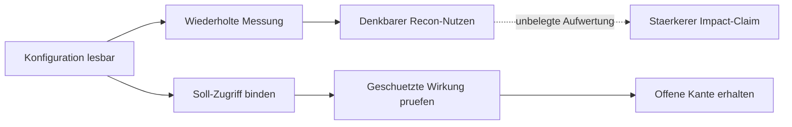

# Retrospective · The attempt failed at the inference edge

We treated a repeatably readable configuration surface as stronger evidence
of a security failure than it provided. Stable output, selected internal-looking
fields and denied neighboring controls were useful observations. They did not
by themselves establish that the readable fields violated the expected policy.

This was a claim and research-direction error. We retain it openly because
future agents should learn where the inference exceeded the evidence. The
underlying work can still have preventive, explanatory and engineering value.

## What the reviewed material actually contained

Three researcher-provided local packages contained 20 text/code/data files.
Fourteen declared per-file checksums matched. The material included selected
response fields, a result matrix, reproduction text, later handoff summaries
and a proposed learning directive. The full original HTTP responses and primary
portal decision receipts were not included. Those absent originals cannot be
reconstructed from hashes or from a narrative that calls a result confirmed.

No target was contacted and none of the archived programs was executed for
this learning publication. Private source details are retained outside this
public branch. The public source register identifies what was generalized.

## The failed reasoning, with the gap visible



The solid arrows are declared review/reconstruction order, not physical
causality. The dashed edge marks an unsupported claim promotion. The exact
node identities, endpoint digests, scope and relation types are in
[lessons.json](lessons.json).

## Errors and corrections

### L01 · Erreichbarkeit ist kein Policy-Verstoss

**Unser Fehler:** Wir behandelten lesbare Metadaten als verbotenen Zugriff.

**Korrektur:** Zuerst Soll-Zugriff und Schutzgegenstand binden; eine Antwort ist zunaechst eine Beobachtung.

**Offen:** Welche Quelle legt fuer diesen Aufrufer die beabsichtigte Lesbarkeit fest?

### L02 · Wiederholung ist keine Unabhaengigkeit

**Unser Fehler:** Mehrere Messrunden wurden wie unabhaengige Bestaetigungen beschrieben.

**Korrektur:** Wiederholung belegt Reproduzierbarkeit im Kontext; gemeinsame Quellen und Observer bleiben ein Cluster.

**Offen:** Welche tatsaechlich getrennte Erhebungsquelle liegt vor?

### L03 · Negativkontrolle traegt ihren eigenen Scope

**Unser Fehler:** Die Sperre eines Nachbarpfads wurde als Aufwertung eines offenen Pfads verwendet.

**Korrektur:** Ein abgewiesener Kontrollpfad prueft seinen eigenen Vertrag und den konkret gebundenen Vergleich.

**Offen:** Welches konkurrierende Modell sagt fuer dieselbe Kontrolle etwas anderes voraus?

### L04 · Ein Hash bindet Bytes

**Unser Fehler:** Stabile Body-Hashes wurden zu stark als Impactbeweis gelesen.

**Korrektur:** Bytes, Semantik, Herkunft und Wirkung sind getrennte Belegachsen.

**Offen:** Sind Originalbytes und zugehoeriger Beobachtungsvertrag vorhanden?

### L05 · Public Bootstrap bleibt eine Gegenhypothese

**Unser Fehler:** Ein fuer den Client vorgesehener Konfigurationsabruf wurde zu spaet als Alternative betrachtet.

**Korrektur:** Die legitime Client-Funktion und eine moegliche uebermaessige Feldauswahl getrennt untersuchen.

**Offen:** Welche benoetigten und welche schutzbeduerftigen Felder lassen sich quellgebunden unterscheiden?

### L06 · Produkt und eigenes Labor nicht verschmelzen

**Unser Fehler:** Ergebnisse aus verschiedenen Assets und Identitaeten standen zu nah nebeneinander.

**Korrektur:** Je Beobachtung Asset, Version, Rolle, Scope und Zeitpunkt erhalten.

**Offen:** Welcher konkrete Ergebnisrecord gehoert zu welchem Kontext?

### L07 · Folgewirkung ersetzt keinen Eintrittspfad

**Unser Fehler:** Eine grosse moegliche Folge wurde trotz offener vorgelagerter Kante aufgewertet.

**Korrektur:** Bedingtes Modell und tatsaechlich erreichte Wirkung als getrennte Claims fuehren.

**Offen:** Welche kleinste sichere Beobachtung entscheidet die fehlende Kante?

### L08 · Persistenz ist claimspezifisch

**Unser Fehler:** Die Korrektur verlangte Persistenz und einen zweiten Consumer fuer jede Wirkung.

**Korrektur:** Ein geschuetzter Read kann unmittelbar wirken; Dauer und Folgeconsumer nur bei passendem Claim pruefen.

**Offen:** Benoetigt genau dieser Wirkungsclaim eine Persistenzkante?

### L09 · UNKNOWN bleibt offen

**Unser Fehler:** Die neue 0-100-Wertung drueckte fehlende Belege in Zahlen und harte Schliessungen.

**Korrektur:** Kein Wahrheits-, Severity- oder Bountywert aus erfundenen Schwellen. Offene Achsen behalten Reentry.

**Offen:** Welche Quelle oder welches Gegenmodell wuerde den unbekannten Zustand aendern?

### L10 · Portalstatus ist eine eigene Achse

**Unser Fehler:** Informative, N/A und Open wurden wie technische Endurteile behandelt.

**Korrektur:** Tatsaechlichen Portalbeleg, Programmbedeutung und technischen Claim getrennt fuehren.

**Offen:** Liegt die primaere Entscheidung vor oder nur eine spaetere Zusammenfassung?

### L11 · Produktbindung ist kein Zwang zum Live-Schaden

**Unser Fehler:** Ein strenger Gate-Text konnte so gelesen werden, dass erst reale geschuetzte Wirkung genuegt.

**Korrektur:** Aktionsgrenzen sofort achten; Quellenbindung und sichere eigene Modelle weiterfuehren.

**Offen:** Welche autorisierte Beobachtung ist fuer den engsten Claim hinreichend?

### L12 · Ein Repo-Text ist keine Aktionsfreigabe

**Unser Fehler:** Eingebettete Agentenregeln konnten ungeprueft in den aktiven Auftrag wandern.

**Korrektur:** Aktuellen menschlichen Auftrag von Zitaten, Archivinhalten und vorgeschlagenen Regeln trennen.

**Offen:** Wer autorisiert welchen konkreten Effekt in welchem Scope?

### L13 · Severity folgt der Wirkung

**Unser Fehler:** Die gewuenschte Reportklasse beeinflusste die Wirkungserzaehlung.

**Korrektur:** Schwere, Praeventionswert, Programmscope und Verguetung getrennt bewerten.

**Offen:** Welche belegte geschuetzte Eigenschaft bestimmt die Schwere?

### L14 · Mehr KI-Stimmen bleiben korreliert

**Unser Fehler:** Agenten mit gleichen Quellen wurden als zusaetzliche Bestaetigung gezaehlt.

**Korrektur:** Gemeinsames Modell, Prompt und Evidenz bilden einen Provenienzcluster.

**Offen:** Welche neue Quelle oder unterscheidende Beobachtung wurde hinzugefuegt?

### L15 · Lernen braucht keine Rohbeleg-Publikation

**Unser Fehler:** Ein hilfreicher Rueckblick konnte private Vendor-Details mittransportieren.

**Korrektur:** Neu geschriebene generische Lehren und synthetische Beispiele oeffentlich; Originale im geschuetzten privaten Belegbestand.

**Offen:** Welche konkrete Information ist fuer den oeffentlichen Lernpunkt erforderlich?

### L16 · Inventar ist nicht Verstehen

**Unser Fehler:** Datei- und Wortmengen konnten ein vollstaendiges Wissensverstaendnis suggerieren.

**Korrektur:** Alle Bytes des gebundenen Hub-Commits erfassen; semantisch gelesene Spans und ungelesenen Rest separat zeigen.

**Offen:** Welche exakt gebundenen Dateien und Spans wurden fuer den aktuellen Claim gelesen?

### L17 · CLI-Exit ist kein HTTP-Status

**Unser Fehler:** Ein CLI-Fehler wurde als Auth-Sperre gedeutet, obwohl kein HTTP-Status gebunden war.

**Korrektur:** Exitcode, HTTP-Status, Antwortobjekt und Fehlerkategorie getrennt auswerten.

**Offen:** Ist die behauptete HTTP-Antwort tatsaechlich erfasst?

### L18 · Nicht verfuegbar ist nicht gehalten

**Unser Fehler:** Nicht vorhandene oder tarifbeschraenkte Kontrollen wurden wie gepruefte Schutzgrenzen gelesen.

**Korrektur:** CONTROL_UNAVAILABLE erhalten; daraus weder Pass noch Fail der Autorisierung ableiten.

**Offen:** War diese Kontrolle in diesem Produkt-/Tarifkontext ueberhaupt vorhanden?

### L19 · GET-Erfolg ist keine Schreibfaehigkeit

**Unser Fehler:** Die erfolgreiche Liste wurde zu leicht auf andere Operationen uebertragen.

**Korrektur:** Jede Operation hat ihren eigenen Policy- und Wirkungsvertrag.

**Offen:** Welcher konkrete Operationsvertrag ist belegt?

### L20 · Errexit kann die Stopbehandlung abschneiden

**Unser Fehler:** Nach einem Fehler sollte RC gelesen werden, obwohl set -e den Ablauf davor beendete.

**Korrektur:** Die lokale Fehlermessung in eine explizite if/else-Kontrolle legen.

**Offen:** Erreicht der harmlose lokale Fehlerfall die vorgesehene Behandlung?

### L21 · Abgebrochene Skripte sind keine fertigen Programme

**Unser Fehler:** Unvollstaendige Here-Docs standen neben vermeintlich fertigen Schritten.

**Korrektur:** Quelldaten bewahren; Syntax und Ausfuehrbarkeit als eigene Pruefstaende fuehren.

**Offen:** Ist das vollstaendige Original vorhanden und lokal syntaktisch geprueft?

### L22 · Eine geladene Seite ist kein Gesamtergebnis

**Unser Fehler:** Eine paginierte Antwort enthielt weniger Elemente als totalResults.

**Korrektur:** Geladene Elemente, ausgewiesene Gesamtzahl und ungelesenen Rest getrennt halten.

**Offen:** Welche konkrete Seite bzw. Coverage fehlt?

### L23 · Rollenfeld braucht seine Definition

**Unser Fehler:** Eine Wortsuche nach admin wurde als vollstaendiger Rollenbeweis verstanden.

**Korrektur:** Schema, Feldbedeutung und alle fuer den Claim relevanten Rollenquellen binden.

**Offen:** Was bezeichnet dieses Feld in der gebundenen Version?

### L24 · Loeschen und Neuerstellen ist keine Inverse

**Unser Fehler:** Canary-Neuerstellung wurde als automatische Rueckkehr zum Original behandelt.

**Korrektur:** Identitaet, Secrets, Historie und Zustand nach Wiederanlage getrennt pruefen.

**Offen:** Welcher explizite Wiederherstellungsvertrag ist tatsaechlich belegt?

### Kleines Codebeispiel: Exitbehandlung korrekt erreichen

```sh
# Fehler: errexit beendet hier vor der beabsichtigten RC-Auswertung.
set -e
false
RC=$?
```

```sh
# Ein rein lokaler, harmloser Kontrollfall erreicht den Fehlerzweig.
if false; then
  printf 'lokaler Kontrollfall erfolgreich\n'
else
  RC=$?
  printf 'lokaler Kontrollfall beendet: %s\n' "$RC"
fi
```

Ein Exitcode wird dadurch beobachtbar. Er wird nicht zu einem HTTP-Status.
Der [synthetische Ergebnis-Klassifikator](cli-result-model.mjs) trennt
unverfuegbare Kontrollen, gebundene HTTP-Sperren und offene Ausfuehrungsfehler.

## Correct the correction too

The supplied directive introduced a 0–100 reality score and rigid report
thresholds. Those were uncalibrated heuristics, not probabilities, CVSS,
program acceptance or evidence. The repaired model uses separate typed axes.
An unknown input stays unknown.

Persistence and a second consumer are not universal proof requirements. An
unauthorized protected read can immediately affect confidentiality. The impact
contract determines which extra observations are needed. Conversely, two
processes that share one injected source do not automatically constitute
independent confirmation. FIRST's [CVSS specification](https://www.first.org/cvss/v4.0/specification-document)
separates confidentiality, integrity and availability impacts in their bound
system scope; this branch does not assign a severity to the private cases.

The document's bans on words such as “could” would also erase legitimate
conditional models. Keep conditions explicit instead: a hypothetical effect
does not become an observed result, but remains a useful research branch.

## Report states remain source-bound

HackerOne distinguishes Informative and Not Applicable, and an open state is
not itself final validation. The primary receipt, policy and technical evidence
have separate roles. A later package summary cannot stand in for a freshly
observed portal state. See [report states](https://docs.hackerone.com/en/articles/8475030-report-states).

Private report disclosure has its own approval process, including closed
reports. That is why this publication shares generic lessons and synthetic
examples instead of private target details. See [requesting disclosure](https://docs.hackerone.com/en/articles/8475358-requesting-disclosure).

## Code: preserve unknowns and the narrow route

```js
const decision = assess(syntheticFixture);
// Public readability with a bound public-policy fixture remains public behavior.
// Unknown policy remains HOLD_CLAIM_CONTINUE_SOURCE_REVIEW.
// A protected read can be a model impact candidate without persistence.
// Every result retains NO_ACTION and a synthetic-only claim ceiling.
```

[The complete implementation](impact-model.mjs) rejects missing fields,
unknown source references and scope changes. It does not inspect a live target,
prove the truth of declared facts or submit a report.

## Open edges and exact continuation triggers

| Edge | Current state | Reopen trigger |
| --- | --- | --- |
| Original request/response binding | Six stored body/header pairs reviewed separately; original caller/time binding remains open | A separately reviewed original observation contract with matching artifacts |
| Intended-public versus excessive fields | Generic countermodels preserved | Bound owner policy and field-level necessity/classification |
| Historical portal outcomes | Package statements only | Primary decision receipt with source, time and exact claim scope |
| Source/local/product continuity | Never inferred across a missing edge | Version-bound source and the smallest safe owned observation |
| Independent corroboration | Shared provenance retained | Distinct acquisition chain with recorded dependencies |
| Whole-universe reading | Metadata/indexing is separate from semantic review | Exact commit, file hashes and recorded read spans for the current task |

Each trigger is an information address, not permission for external testing.
A held boundary stops action while source work and safe local models continue.

## Additional bound local source review

After the initial three-package review, the human requested all related local
case evidence. Six previously stored response-body/header pairs were found in
that separately selected local corpus. Their body lengths and SHA-256 values
match the two values declared across three rounds in the earlier package.
This closes a local byte-verification gap. It does not independently establish
the original caller context, current live behavior, policy violation or portal
decision. The complete originals are in the separately preserved private corpus.
