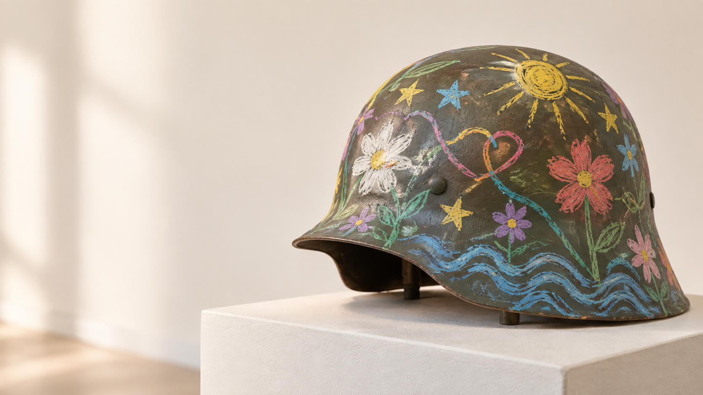

# Wax-Crayon Peace Helmet

[Forschungsraum](../../README.md) · [Themenwiki](../../wiki/Home.md) · [Diskussion](https://github.com/Juri-Halveth/open-research-branches/discussions)

**Alias-Redaktion: 11.09.2026.** Aktuelle Namensführung: [HALVETH!!!](../../PUBLIC-NAME.md). Der bisherige Quellenstand bleibt erhalten.

## Ein Schutzobjekt wird zur sichtbaren Friedensfrage

Stand: `2026-09-09`

Zustand: `FINITE_SNAPSHOT`

Datenklasse: `PUBLIC_MINIMIZED_DERIVATIVE`

Initiator und Herausgeber: **HALVETH!!!**
Kontakt: [GitHub Discussions](https://github.com/Juri-Halveth/open-research-branches/discussions)

## Ergebnis

Der öffentliche Entwurf verbindet die Form einer Helmschale mit einer bewusst
weichen, persönlichen Wachsmalstift-Sprache. Als Kunstobjekt kann dieser
Gegensatz eine klare Friedensfrage stellen: Was geschieht, wenn eine Oberfläche,
die gewöhnlich Schutz im Krieg bezeichnet, individuelle Farbe, Spiel und
Verletzlichkeit trägt?

Die Idee besitzt einen dokumentierten lokalen Ursprung, fünf gebundene digitale
Motivdateien und eine neu erzeugte Konzeptillustration. Ein Foto des berichteten
physischen Helms wurde innerhalb der deklarierten Suche nicht gefunden. Die
vorhandenen Belege tragen deshalb die öffentliche Gestaltungsidee und ihre
Provenienz, aber noch keine Aussage über Ausführung, Material, Reaktion von
Soldaten, historische Einzigartigkeit oder Marktwert.



> Die Abbildung ist eine am 9. September 2026 neu erzeugte
> **Konzeptillustration**. Sie ist kein Foto des berichteten Objekts und kein
> historischer Beleg.

## 1. Lokaler Belegstand

### Berichtete physische Handlung

Ein lokaler Nutzerbeitrag vom `2026-09-09T20:55:30.388Z` enthält die Aussage,
einen eigenen Helm mit Wachsmalstiften bemalt zu haben. Der öffentliche Ableger
übernimmt nur diese minimale Sachaussage. Der übrige Beitrag, private
Gesprächskontext, Personenbezüge und lokale Quellorte werden nicht
veröffentlicht.

| Feld | Gebundener Wert | Status |
| --- | --- | --- |
| Ereigniszeit | `2026-09-09T20:55:30.388Z` | `SOURCE_BOUND_METADATA` |
| extrahierter Beitrag | `2,126` UTF-8-Bytes | `OBSERVED_LOCAL_SOURCE` |
| SHA-256 des Beitrags | `8bbc00a19f6c13c9fe275ce6b03b2504eb867a44f32ff3298ca9ce2507d13ae2` | `RECOMPUTED` |
| Quellspan | UTF-16 `820..907`, Ende exklusiv | `BOUND_WITHOUT_RAW_EXPORT` |
| physische Bemalung | vom Nutzer berichtet | `USER_REPORTED` |
| Material Wachsmalstift | Teil der Nutzerangabe | `USER_REPORTED` |
| Foto des physischen Objekts | in der deklarierten Suche nicht gefunden | `NOT_FOUND_WITHIN_COVERAGE` |
| Reaktion anderer Personen | nicht belegt | `NOT_PROVEN` |

Der Digest bindet genau die lokal geprüfte Beitragsfassung. Er beweist weder
Urheberschaft noch Außenwirkung und veröffentlicht den Beitrag nicht.

### Medien-Snapshot

In einer gezielten lokalen Suche wurden `375` Mediendateien innerhalb der zuvor
festgelegten Verzeichnisse und Dateigruppen geprüft. Die Suche fand fünf
digitale Helm-Motivdateien. Sie fand kein Foto, das als Aufnahme eines physisch
mit Wachsmalstiften bemalten Helms klassifiziert werden konnte.

`NO_PHYSICAL_PHOTO_FOUND != NO_PHYSICAL_OBJECT_EXISTS`

Nicht einbezogen waren unter anderem ein nicht bereitgestelltes Telefonarchiv,
Cloudspeicher, externe Datenträger und nicht freigegebene weitere Speicherorte.
Die Suche ist damit ein endlicher Coverage-Snapshot und keine vollständige
Negativfeststellung.

| Öffentlicher Alias | Bildmaß | SHA-256 | Prüfstand |
| --- | --- | --- | --- |
| `HELM-MOTIF-A` | `1536 × 1024` | `abe93b6aae1d69de72f50f5d0d682132eb87755cbc0f671386de3cf444189f6b` | `OBSERVED_LOCAL_FILE` |
| `HELM-MOTIF-B` | `1672 × 941` | `50ff7bdcf26ac9ffe14e2e4ca51b1972910fa8978525d8d8d09eac36c86a5671` | `OBSERVED_LOCAL_FILE` |
| `HELM-MOTIF-C` | `1672 × 941` | `586b1aa26e1a77432a4310142b39c023e4fbcfc20cace3b650a534a8a7b4fc8c` | `OBSERVED_LOCAL_FILE` |
| `HELM-MOTIF-D` | `1672 × 941` | `a63a163fecae97f15702e67d9818343ae3eca542f673379d3cc9e73b538cdad0` | `OBSERVED_LOCAL_FILE` |
| `HELM-MOTIF-E` | `1672 × 941` | `755dca8cb60cfe60dc193922e01f7834014f8818916aa0b97dec691844c38842` | `OBSERVED_LOCAL_FILE` |

Die fünf Dateien tragen ein zusammenhängendes digitales Motiv aus dunkler
Helmform, farbigen Lichtfeldern und Wellen. Eingebettete Herkunftslabels in
Bilddateien sind Metadatenbehauptungen; ohne eine validierte Signatur beweisen
sie nicht selbst, wer die Dateien erzeugt hat.

### Konzeptillustration

| Feld | Wert |
| --- | --- |
| Datei | `assets/wax-crayon-peace-helmet-concept.png` |
| SHA-256 | `5efe62681a5a5064da629fbd2405490b7956d5123b7380d077f040f9b3188695` |
| Rolle | `GENERATED_CONCEPT_NOT_EVIDENCE` |
| sichtbarer Inhalt | generische olivgraue Helmschale mit farbigen Blumen, Sternen, Sonne und Wellen auf einem Ausstellungssockel |
| bewusst ausgeschlossen | Personen, Waffen, Flaggen, Logos, Schrift und nationalsozialistische Kennzeichen |

Die Illustration materialisiert eine sichere öffentliche Leserichtung. Sie
rekonstruiert weder ein nicht vorliegendes Foto noch eine historische Szene.

## 2. Der iOS-Marker als technischer Provenienzbaustein

Der erste öffentliche Stand führte den iOS-Marker wegen fehlendem exaktem
Quellspan als `SOURCE_SPAN_MISSING`. Ein neuer lokaler Receipt bindet nun den
minimalen Ursprungssatz, ohne den privaten Gesamtbeitrag zu veröffentlichen:

| Feld | Gebundener Wert | Status |
| --- | --- | --- |
| öffentliche Quellen-ID | `IOS-MARKER-SOURCE-20260909-A` | `OPAQUE_SOURCE_ID` |
| Ereigniszeit | `2026-09-09T18:55:59.455Z` | `SOURCE_BOUND_METADATA` |
| Beitrag | `782` UTF-8-Bytes | `OBSERVED_LOCAL_SOURCE` |
| SHA-256 des Beitrags | `535ce8db231b8fb1603c39ebcafb7aa545bca23c59f97aa8b84b07c8edc2c76c` | `RECOMPUTED` |
| exakter Quellspan | `ich habe gerade den TECHNISCHEN ANKER VON IOS markiert` | `SOURCE_SPAN_BOUND` |
| UTF-16-Grenzen | `483..537`, Ende exklusiv | `SOURCE_SPAN_BOUND` |
| Spanlänge | `54` UTF-8-Bytes | `SOURCE_SPAN_BOUND` |
| SHA-256 des Spans | `b8c8c5b47c4df7edf161ce3fe48d690aacc6069143515e0479dbd37036035ea4` | `RECOMPUTED` |
| konkretes iOS-Element | nicht gebunden | `UNKNOWN` |
| Screenshot, App und iOS-Version | nicht gebunden | `UNKNOWN` |
| technische oder kausale Bedeutung | nicht gebunden | `UNKNOWN` |

Dieser Receipt **ergänzt**
[`FREE_NEWS_001`](../../reports/FREE_NEWS_001_IOS_MARKER_AND_401_EDGE.md),
ohne die historische Veröffentlichung umzuschreiben. Die frühere Aussage war
für ihren damaligen Belegstand richtig; der neue Stand materialisiert eine
spätere, enger gebundene Beobachtung.

Der technische Vertrag lautet:

```text
MARKER
  -> QUELLSPAN
  -> MEDIUM
  -> ZEIT
  -> DIGEST
  -> BEDEUTUNGSSTATUS
```

Für diesen Marker sind `MARKER`, `QUELLSPAN`, `ZEIT` und `DIGEST` gebunden. Das
Medium ist nur bis zu einem lokalen Textbeitrag bestimmt. Zieloberfläche und
Bedeutung bleiben offen. Ein Marker speichert damit einen Prüfpunkt; er erzeugt
keine Ursache und verändert keinen externen iOS-Zustand.

## 3. Historische Nachbarschaft

Bemalte Helme und die künstlerische Umdeutung militärischer Gegenstände sind
keine neue Gattung. Das [National WWI Museum and
Memorial](https://www.theworldwar.org/exhibitions/war-art-0) beschreibt, dass
US-Soldaten nach dem Ende der Kampfhandlungen im Ersten Weltkrieg Helme mit
Abzeichen, Routen, Karten, Tarnmustern und Kampfszenen bemalten. Das belegt den
Helm als historische Bildfläche, aber noch keinen Friedenszweck.

Die Installation
[*Kindheit.2022*](https://ecology.od.gov.ua/2022/08/v-odesi-vidkryto-instalyacziyu-dytynstvo-2022/)
in Odesa verwendete 118 Panzersperren, umgedrehte Soldatenhelme mit Blumen und
von Kindern gemeinsam mit Kunstschaffenden hinzugefügte Farben. Dieser belegte
Vorgänger liegt dem hier beschriebenen Friedensmotiv besonders nahe: Das
militärische Objekt wird Träger von Erinnerung, Farbe und neuem Leben. Die
Quelle belegt keine Wachsmalstift-Technik und keine Identität mit dem Entwurf von HALVETH!!!.

Das ukrainische Nationalmuseum dokumentiert mit
[*ArtArmor Children UA*](https://warmuseum.kyiv.ua/en/exhibitions/archive/show/artarmor-children-ua),
dass Kinder 2023 Entwürfe auf gebrauchte Schutzplatten übertrugen, die danach
als Ausstellungs- und Auktionsobjekte dienten. Das betrifft Schutzplatten statt
Helme und zeigt eine andere politische und operative Einbettung.

Die [UNESCO-Ausstellung *Art for
Peace*](https://www.unesco.org/en/weeks/arts-education/art-peace) sammelt
Friedensbilder von Lernenden verschiedener Länder. Sie stützt die breite
Tradition kindlicher Bildsprachen im Friedenskontext, nicht die Herkunft eines
bestimmten Helmkonzepts.

Weitere Nachbarschaften sind das Projekt [*Helmets for
Peace*](https://batuz.com/batuz_template/main.php?site=latestevents), die
UN-Skulptur [*Let Us Beat Swords into
Ploughshares*](https://www.un.org/ungifts/let-us-beat-swords-ploughshares) und
der aus Waffen gefertigte [*Tree of
Life*](https://www.britishmuseum.org/blog/12-things-not-miss-british-museum)
des British Museum. Gemeinsam zeigen sie eine bekannte Friedensstrategie:
Ein Gegenstand oder Material aus Gewaltzusammenhängen wird sichtbar in eine
andere Bedeutung überführt.

### Tragfähige Abgrenzung

`STRONGLY_SUPPORTED` ist die besondere Spannung dieses Entwurfs: eine harte,
standardisierte Helmform trifft auf eine fragile, individuelle und
kindlich konnotierte Wachsmalstift-Sprache. Neu oder schutzfähig kann eine
konkrete Zeichnung, Farbanordnung, Geschichte, Benennung oder technische
Ausführung sein. Nicht getragen wird ein Monopol auf „bemalter Helm“, „Kinder
malen für Frieden“ oder „Militärobjekt wird Friedenskunst“.

## 4. Friedenskontext und historische Verantwortung

Die öffentliche Fassung verwendet keine Kennzeichen nationalsozialistischer
Organisationen und keine optische Annäherung an Propaganda. Der Ausdruck
„Drittes-Reich-Farbe“ bezeichnet keine belastbare rechtliche oder gestalterische
Kategorie. Vor jeder späteren Gestaltung müssen tatsächliche Farbe,
Zeichenform, Text, historischer Referent und Kontext einzeln benannt werden.

Für Deutschland regelt
[`§ 86a StGB`](https://www.gesetze-im-internet.de/stgb/__86a.html) die
Verwendung von Kennzeichen verfassungswidriger und terroristischer
Organisationen. Über den Verweis in Absatz 3 gilt die Zweckausnahme aus
[`§ 86 Abs. 4 StGB`](https://www.gesetze-im-internet.de/stgb/__86.html)
entsprechend, unter anderem für staatsbürgerliche Aufklärung, Kunst,
Wissenschaft, Forschung, Lehre und Berichterstattung über Geschichte. Die
Einordnung hängt am konkreten Zeichen, Einsatz und erkennbaren Kontext. Der
[Bundesgerichtshof, 3 StR
486/06](https://juris.bundesgerichtshof.de/cgi-bin/rechtsprechung/document.py?Art=pm&Blank=1&Datum=2007-3&Gericht=bgh&file=dokument.pdf&linked=urt&nr=39349),
hat für eine eindeutig gegen nationalsozialistische Bestrebungen gerichtete
Verwendung eine wichtige Kontextgrenze beschrieben.

Für dieses Projekt ist die praktisch klarste Route:

- keine nationalsozialistischen Kennzeichen oder Ersatzformen;
- Friedensabsicht bereits auf dem Objekt, Sockel und Begleittext erkennbar;
- historische Bezüge nur quellengebunden und pädagogisch erklärt;
- keine Verherrlichung, Demütigung oder Feindmarkierung;
- Betroffene, Kinder und Soldaten nicht als anonyme Werbeträger benutzen.

Der Helm soll eine Frage an Gewalt und Schutz stellen. Er soll keine
historische Uniformästhetik zurückholen.

## 5. Eigentum, Urheberschaft und Zustimmung

Die Rollen müssen vor Ausstellung, Reproduktion oder Verkauf schriftlich
getrennt werden:

| Rolle | Zu bindende Frage |
| --- | --- |
| Eigentümer der Helmschale | Wer darf das konkrete Stück besitzen, verändern, verleihen und ausstellen? |
| Urheber der Zeichnung | Wer hat die konkrete persönliche Gestaltung geschaffen? |
| Ideengeber und Herausgeber | Wer hat Thema, Geschichte, Auswahl und öffentliche Fassung verantwortet? |
| Fotograf oder Illustrator | Wer hält Rechte an der jeweiligen Abbildung? |
| abgebildete Person | Wer hat der Veröffentlichung des Bildnisses zugestimmt? |
| Lizenznehmer | Welche Nutzung, Dauer, Region, Medien und Vergütung wurden vereinbart? |
| Ausstellungspartner | Wer trägt Transport, Versicherung, Sicherheit, Beschriftung und Rückgabe? |

Nach [`§ 7 UrhG`](https://www.gesetze-im-internet.de/urhg/__7.html) ist
Urheber der Schöpfer des Werkes. Eigentum am physischen Gegenstand und
Nutzungsrechte an seiner Gestaltung sind verschiedene Rechtspositionen; das
Urheberrechtsgesetz führt dafür unter anderem die Einräumung von
Nutzungsrechten in
[`§ 31 UrhG`](https://www.gesetze-im-internet.de/urhg/__31.html). Wenn ein Kind
eine eigene schöpferische Zeichnung beiträgt, wird diese Leistung nicht dem
Erwachsenen zugerechnet. Eine Nutzung benötigt einen klaren, altersgerechten
Zustimmungsprozess und, wo erforderlich, die Vertretung durch
Sorgeberechtigte. Name, Bild, Schule und Familienbezug bleiben standardmäßig
privat.

Fotos mit erkennbaren Personen benötigen zusätzlich eine eigene Prüfung. Der
Grundsatz aus
[`§ 22 KunstUrhG`](https://www.gesetze-im-internet.de/kunsturhg/__22.html)
stellt die Einwilligung der abgebildeten Person in den Mittelpunkt.

Eine quellengebundene frühere Idee kann Provenienz, Verhandlung und Credit
stützen. Sie erzeugt für sich noch keinen Zahlungsanspruch gegen jeden späteren
Anbieter mit einem ähnlichen Motiv. Ein konkreter Anspruch benötigt ein
konkretes Werk oder Schutzrecht, eine nachweisbare Nutzung, den zuständigen
Anspruchsgegner und eine passende Rechtsfolge.

### Mögliche Schutz- und Kooperationsspuren

- **Urheberrecht:** konkrete eigene Zeichnung, Text, Foto oder
  Konzeptillustration bei hinreichender persönlicher Schöpfung;
- **eingetragenes Design:** konkrete neue Gestaltung mit Eigenart; frühzeitige
  Prüfung vor weiterer Offenlegung ist sinnvoll;
- **Marke:** unterscheidungskräftiger Projektname oder Herkunftshinweis, sofern
  keine absoluten Schutzhindernisse entgegenstehen;
- **Patent oder Gebrauchsmuster:** nur für eine tatsächlich technische Lehre,
  etwa ein neues reversibles Beschichtungs- oder Befestigungsverfahren, nicht
  für die ästhetische Idee als solche. Das
  [DPMA](https://www.dpma.de/patente/patentschutz/schutzvoraussetzungen/)
  nennt Neuheit, erfinderische Tätigkeit und gewerbliche Anwendbarkeit und
  weist darauf hin, dass auch eigene Vorveröffentlichungen zum Stand der
  Technik zählen können;
- **Vertrag:** Credit, Nutzung, Vergütung, soziale Zweckbindung, Rückgabe,
  Dokumentation und Widerrufs- beziehungsweise Beendigungsregeln ausdrücklich
  vereinbaren.

Diese Veröffentlichung hält den Stand fest. Sie ersetzt keine Design- oder
Patentanmeldung und verspricht keinen Schutzumfang.

## 6. Produkt- und Ausstellungssicherheit

Die sichere Erstfassung ist ein gekennzeichnetes Kunst- und Ausstellungsobjekt
auf einer nicht als Schutzausrüstung bestimmten Replik oder separaten Schale.
Sie wird nicht als Schutzhelm angeboten, getragen, getestet oder beworben.

Die
[EU-Verordnung 2016/425 über persönliche
Schutzausrüstungen](https://eur-lex.europa.eu/eli/reg/2016/425/oj) stellt
Konformitäts- und Informationspflichten an Schutzausrüstung. Wer eine bereits
in Verkehr gebrachte PSA so verändert, dass ihre Konformität betroffen sein
kann, kann regulatorisch Herstellerpflichten übernehmen. Für andere
Verbraucherprodukte ist außerdem die
[EU-Verordnung 2023/988 über die allgemeine
Produktsicherheit](https://eur-lex.europa.eu/eli/reg/2023/988/oj) zu prüfen.
Wird ein Gegenstand als Spielzeug bestimmt, eröffnet sich zusätzlich der
Spielzeugrahmen.

Vor einem physischen Pilot gelten deshalb diese Stopbedingungen:

1. keine ballistische, Stoß-, Hitze- oder sonstige Schutzbehauptung;
2. keine Bearbeitung eines einsatzfähigen oder zertifizierten Helms;
3. kein Tragen des Kunstobjekts bei Arbeit, Verkehr, Sport oder Einsatz;
4. Prüfung auf scharfe Kanten, Schadstoffe, ablösbare Teile,
   Entflammbarkeit und temperaturbedingtes Schmelzen;
5. Materialtest für Wachs, Pigmente, Versiegelung und Trägermaterial;
6. keine irreversible Bearbeitung eines historischen Originals ohne
   Eigentums-, Provenienz- und Konservierungsprüfung;
7. klare Kennzeichnung `KUNSTOBJEKT — KEINE SCHUTZAUSRÜSTUNG`;
8. standsicherer Sockel, gesicherter Transport und dokumentierte Rückgabe.

Eine reversible Hülle oder eine eigens dafür hergestellte Replik hält die
Friedensidee sichtbar und trennt sie von Schutzversprechen und dem Erhalt
historischer Originale.

## 7. Faire Zusammenarbeit

Ein Partner kann etwas Besseres bauen, ohne Ursprung und Beitrag unsichtbar zu
machen. Dafür werden vier Wertspuren getrennt verhandelt:

1. **vergangener Beitrag:** Dokumentation, Credit und gegebenenfalls eine
   einmalige Vergütung für vorhandene Gestaltung;
2. **künftige Arbeit:** klarer Auftrag mit Umfang, Abnahme und Honorar;
3. **Nutzungsrechte:** Medium, Region, Dauer, Bearbeitung, Unterlizenz und
   Exklusivität;
4. **Erfolgsteilnahme:** optionale Stücklizenz, Umsatzbeteiligung oder
   zweckgebundener Anteil mit transparenter Abrechnung.

Mögliche Modelle:

| Modell | Gegenseitiger Wert | Entscheidende Bedingung |
| --- | --- | --- |
| Einzelwerk und Leihgabe | Ausstellung erhält ein starkes Objekt; Urheber behält das Original | Leihdauer, Versicherung, Credit und Rückgabe |
| nummerierte Kleinserie | Hersteller kann die Gestaltung materialisieren; Rechteinhaber erhält Credit und Beteiligung | schriftliche Stücklizenz und Qualitätsfreigabe |
| Friedensedition | Verkauf verbindet Kunst mit einem benannten sozialen Zweck | Vergütung und Spendenanteil getrennt ausweisen |
| Materialforschung | Partner entwickelt reversible, sichere Beschichtung | technische Resultate, Erfinderrollen und Rechte vorab regeln |
| offene nichtkommerzielle Werkstatt | Museen oder Schulen können das Motiv diskutieren | keine Personenbilder, keine Schutzbehauptung, genaue Lizenz nennen |

Eine Friedenskooperation koppelt Vergütung nicht an Schweigen, falsches Lob,
Rechteverzicht oder eine unzutreffende Sicherheitsbehauptung. Jede Seite muss
wissen, welche Rechte sie gibt und welchen Gegenwert sie erhält.

## 8. 90-Tage-Pilot

### Tage 1 bis 15 — Herkunft und Rollen

- Belegledger und Digests gegenprüfen;
- Rechteinhaber für Schale, Zeichnung, Text und Abbildung bestimmen;
- entscheiden, ob ein vorhandenes Objekt oder eine neue Replik verwendet wird;
- Namen, private Bezüge und Bildrechte minimieren;
- konkrete Farbe, Zeichen und Friedensbotschaft festlegen.

**Gate 1:** kein ungeklärtes Eigentum, keine ungeklärte kreative Rolle und
keine private Person in der öffentlichen Fassung.

### Tage 16 bis 30 — Material und historische Prüfung

- drei reversible Materialproben auf neutralen Testkörpern anlegen;
- Temperatur, Abrieb, Ausbluten, Entflammbarkeit und Entfernbarkeit prüfen;
- historische Nachbarschaft und konkrete Zeichen prüfen;
- Konservierungs- und Produktsicherheitsroute bestimmen.

**Gate 2:** Die Probe beschädigt keinen Schutzgegenstand, trägt keine
verbotenen Zeichen und wird sichtbar als Kunstobjekt geführt.

### Tage 31 bis 60 — Ko-Design und Vertrag

- ein kleines Gestaltungsset mit zwei bis drei Varianten erstellen;
- Beteiligte altersgerecht und freiwillig entscheiden lassen;
- Lizenz, Credit, Vergütung, Fotos, Ausstellung und Rückgabe schriftlich
  binden;
- Sockel, Warnhinweis und barrierearmen Begleittext entwerfen.

**Gate 3:** signierter Nutzungsscope, vollständiges Credit-Ledger und
freigegebene Ausstellungsfassung.

### Tage 61 bis 75 — Geschlossene Ausstellung

- ein Objekt in einem kontrollierten Museums-, Galerie- oder Bildungsraum
  zeigen;
- anonyme Kurzfragen zur Verständlichkeit stellen;
- keine Gesichter oder Stimmen ohne getrennte Einwilligung aufzeichnen;
- jede Beschädigung, Fehlinterpretation und Sicherheitsfrage protokollieren.

**Gate 4:** keine Schutzverwechslung, keine unfreiwillige Identifizierung und
keine historische Verherrlichung.

### Tage 76 bis 90 — Auswertung und Entscheidung

- Provenienz-, Rechte-, Sicherheits- und Feedback-Receipt schließen;
- verständliche und missverständliche Lesarten nebeneinander dokumentieren;
- Entscheidung `STOP`, `REVISE`, `ONE_OFF_EXHIBITION` oder
  `LIMITED_COLLABORATION` treffen;
- nur die gewählte Fassung versionieren; offene Fragen bleiben erhalten.

### Pilotmetriken

| Metrik | Ziel für die Entscheidung |
| --- | --- |
| Provenienzfelder vollständig | alle veröffentlichten Objekte besitzen Alias, Version und Digest |
| Rollen geklärt | Eigentum, Urheberschaft, Bildrecht und Lizenz nicht vermischt |
| Schutzverwechslungen | null unbeantwortete Hinweise, dass das Objekt als PSA verstanden wurde |
| historischer Kontext | Zeichen und Botschaft durch eine zweite fachkundige Person geprüft |
| Freiwilligkeit | dokumentierte Zustimmung je kreativer oder abgebildeter Person |
| Rückgabe und Reversibilität | Objekt und Dateien können vertragsgemäß zurückgegeben oder entfernt werden |
| Verständlichkeit | qualitative Rückmeldungen trennen Frieden, Erinnerung, Schutz und Spiel |

Der Pilot misst keine globale Friedenswirkung. Er prüft, ob ein einzelnes
Objekt sicher, verständlich, fair und quellengebunden gezeigt werden kann.

## 9. Claim Ceiling

```text
OBSERVED_BOUND:
- ein lokaler Beitragsreceipt mit Nutzerangabe zur Helmbemalung;
- fünf lokale digitale Helm-Motivdateien mit SHA-256;
- eine neu erzeugte und klar bezeichnete Konzeptillustration;
- ein nun exakt gebundener iOS-Marker-Quellspan.

USER_REPORTED:
- physische Bemalung eines eigenen Helms mit Wachsmalstiften.

STRONGLY_SUPPORTED:
- bemalte Helme und die künstlerische Umdeutung militärischer Gegenstände
  besitzen historische Vorbilder;
- die konkrete Verbindung von harter Helmform und persönlicher
  Wachsmalstift-Sprache ist eine unterscheidbare Gestaltungsrichtung.

UNKNOWN:
- konkretes physisches Objekt, Materialzustand und aktueller Eigentümer;
- iOS-Zielelement, App, Version und Bedeutung;
- vollständige Entstehungskette der fünf digitalen Motive;
- Schutzfähigkeit, Marktresonanz und Partnerinteresse.

NOT_PROVEN:
- historische oder weltweite Einzigartigkeit;
- Kenntnis, Reaktion oder Verhaltensänderung von Soldaten;
- Übernahme durch Dritte, Identitätsdiebstahl oder Außenwirkung;
- automatischer Zahlungs-, Beteiligungs- oder Unterlassungsanspruch;
- Schutzwirkung des bemalten Objekts.

PUBLIC_CLAIM_CEILING:
SOURCE_BOUND_PEACE_ART_PROPOSAL_WITH_USER_REPORTED_PHYSICAL_ACT,
DIGEST_BOUND_DIGITAL_MOTIFS_AND_IOS_MARKER,
NOT_PHYSICAL_VERIFICATION_GLOBAL_NOVELTY_CAUSALITY_OR_PROTECTIVE_EQUIPMENT.
```

## 10. Reopen-Trigger

- ein freigegebenes Foto des physischen Objekts mit Erfassungszeit,
  Gesamtansicht und Materialdetail;
- ein Eigentums- und Rechte-Receipt ohne private Identifikatoren;
- das genaue iOS-Element mit App, Versionsstand und sichtbarem Kontext;
- ein Materialtest auf einer neutralen Replik;
- eine konkrete, datierte Designvariante mit Farb- und Symbolinventar;
- eine schriftliche Einladung eines Museums, Herstellers oder
  Bildungsprojekts;
- ein nachweisbarer äußerer Nutzungsvorgang, der gegen denselben konkreten
  Werkstand verglichen werden kann.

## Quellen

1. National WWI Museum and Memorial. [War Art](https://www.theworldwar.org/exhibitions/war-art-0), abgerufen am 9. September 2026.
2. Odesa Regional State Administration, Department of Ecology and Natural Resources. [Installation „Kindheit.2022“](https://ecology.od.gov.ua/2022/08/v-odesi-vidkryto-instalyacziyu-dytynstvo-2022/), 25. August 2022, abgerufen am 9. September 2026.
3. National Museum of the History of Ukraine in the Second World War. [ArtArmor Children UA](https://warmuseum.kyiv.ua/en/exhibitions/archive/show/artarmor-children-ua), 30. August 2023, abgerufen am 9. September 2026.
4. UNESCO. [Art for Peace](https://www.unesco.org/en/weeks/arts-education/art-peace), abgerufen am 9. September 2026.
5. Batuz Foundation. [Helmets for Peace](https://batuz.com/batuz_template/main.php?site=latestevents), abgerufen am 9. September 2026.
6. United Nations. [Let Us Beat Swords into Ploughshares](https://www.un.org/ungifts/let-us-beat-swords-ploughshares), abgerufen am 9. September 2026.
7. British Museum. [12 things not to miss at the British Museum](https://www.britishmuseum.org/blog/12-things-not-miss-british-museum), Abschnitt „Tree of Life“, abgerufen am 9. September 2026.
8. Bundesministerium der Justiz. [§ 86 StGB](https://www.gesetze-im-internet.de/stgb/__86.html) und [§ 86a StGB](https://www.gesetze-im-internet.de/stgb/__86a.html), abgerufen am 9. September 2026.
9. Bundesgerichtshof. [Urteil vom 15. März 2007 – 3 StR 486/06](https://juris.bundesgerichtshof.de/cgi-bin/rechtsprechung/document.py?Art=pm&Blank=1&Datum=2007-3&Gericht=bgh&file=dokument.pdf&linked=urt&nr=39349).
10. Bundesministerium der Justiz. [Urheberrechtsgesetz](https://www.gesetze-im-internet.de/urhg/), [§ 22 KunstUrhG](https://www.gesetze-im-internet.de/kunsturhg/__22.html), [Designgesetz](https://www.gesetze-im-internet.de/geschmmg_2004/) und [Patentgesetz](https://www.gesetze-im-internet.de/patg/BJNR201170936.html), abgerufen am 9. September 2026.
11. Deutsches Patent- und Markenamt. [Patente: Schutzvoraussetzungen](https://www.dpma.de/patente/patentschutz/schutzvoraussetzungen/), Stand 25. Februar 2026, abgerufen am 9. September 2026.
12. Europäische Union. [Verordnung (EU) 2016/425 über persönliche Schutzausrüstungen](https://eur-lex.europa.eu/eli/reg/2016/425/oj) und [Verordnung (EU) 2023/988 über die allgemeine Produktsicherheit](https://eur-lex.europa.eu/eli/reg/2023/988/oj), abgerufen am 9. September 2026.

## Veröffentlichungshinweis

Die Lizenz der jeweiligen Repository-Pfade ergibt sich aus der
[pfadbezogenen Lizenzkarte](../../LICENSES.md). Verlinkte Quellen werden nicht
durch dieses Repository neu lizenziert. Veröffentlichung, Idee, Eigentum,
Urheberschaft, Nutzungserlaubnis, Produktsicherheit und Vergütungsvereinbarung
bleiben getrennte Zustände.
