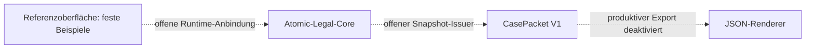

# Atomic Legal Lens: vorhandener Kern und offene Verbindung

Stand: 19. September 2026 · neu geschriebene öffentliche Zusammenfassung einer lokalen Quellenprüfung.

## Was bereits existiert

Die lokale Implementierung enthält einen Atomic-Legal-Core sowie getrennte
CasePacket- und JSON-Crates. Das vorhandene Austauschschema heißt
`halveth.case_packet.v1`; es braucht keine zweite konkurrierende V1-Definition.

Der kanonische Payload führt Schema-ID, Version, Revision, Vorgänger,
Erzeugerversion, Zweck, Jurisdiktion, Rollen, Quellartefakte, Aussagen,
Unbekanntes, Risiken, Gate-Entscheidungen, Offenlegungsprojektion und Review.
Die JSON-Schicht ergänzt `$schema` und `packet_id`.

Diese Feldübersicht beschreibt ein Softwareformat. Sie bestätigt keine
Rechtsquelle, keinen Anspruch und keine individuelle Rechtsbewertung.

## Was in der Verbindung fehlt

Im geprüften Quellstand besitzt `CasePacketV1` keinen öffentlichen Konstruktor.
Die Export-Capability hat noch keinen produktiven Aussteller;
`PRODUCTIVE_JSON_EXPORT_ENABLED` steht auf `false`.
Der im Integrationsentwurf benannte Atomic-Snapshot ist in den drei geprüften
Crates noch nicht implementiert. Ein vollständiger Test vom Atomic-Core bis
zum ausgegebenen Paket und dessen öffentlichem Schema bleibt offen.

Diese Grenzen werden bei einer Integration beibehalten und gezielt erfüllt.
Ein manuell geschriebenes Beispiel müsste als
`ILLUSTRATIVE_NOT_CORE_GENERATED` bezeichnet werden.

## Einordnung der Bilder

Die aktuellen lokalen UI-Dateien verwenden `SYNTHETIC DEMO STATE` und
`NOT_RUNTIME_EVIDENCE`, ein schreibgeschütztes Feld sowie einen ausdrücklichen
Hinweis auf die fehlende Rust-Anbindung. Das JavaScript wählt fest hinterlegte
Beispiele. „Fixpunkt mit Rest-UNKNOWN“ ist dort ein fester Titel.

Die gelieferten älteren Bilder und das spätere Repository-QA-Bild besitzen
verschiedene Dateihashes. Sie bleiben verschiedene Fassungen; eine Korrektur
der späteren UI ändert die früheren Screenshots nicht.

## Frisch ausgeführte, begrenzte Tests

| Testgruppe | Bestanden | Fehler |
| --- | ---: | ---: |
| Atomic-Core einschließlich Integrationstests | 82 | 0 |
| CasePacket-Domain | 19 | 0 |
| CasePacket-JSON | 9 | 0 |
| CasePacket-Konformität | 5 | 0 |
| **Gesamt** | **115** | **0** |

Die Läufe nutzten die bereits installierte Rust-/Cargo-Version 1.97.0,
`--offline --locked` und ein getrenntes Build-Verzeichnis. Quell-HEAD,
sauberer Arbeitsbaum und Lockdatei blieben unverändert. Der Beleg gilt für
diese vier Testgruppen. Der vollständige Workspace, die deklarierte ältere
Mindestversion, ein frischer Browserlauf und ein produktiver End-to-End-Export
wurden damit nicht geprüft.

Die zugehörigen Quell-Hashes, Logs und lokalen Pfade bleiben in einem privaten
Prüfpaket. Öffentliche Leser können diese Testausführung anhand dieses
Berichts allein nicht unabhängig wiederholen. Die lokalen Cargo-Metadaten
führen `UNLICENSED` und `publish = false`; Core-Dateien werden hier nicht
umkopiert oder neu lizenziert.

## Nächster nutzbarer Schritt

Die [Technologie-Roadmap](TECHNOLOGY_ROADMAP_2026-09-19.md) beschreibt die
Integration am bestehenden Vertrag und konkrete Abnahmekriterien. Parallel
sind die öffentlichen [Referenzprüfer](../branches/document-issue-reference-verifier/README.md)
und das [Inventarverfahren](../branches/bounded-knowledge-reuse-inventory/README.md)
bereits als getrennte Prototypen verfügbar.

**English summary:** The local Rust core and CasePacket V1 already exist.
115 scoped tests passed. The UI is a static fixture; the productive
core-to-packet export path remains incomplete. This public derivative records
the development gap and the next acceptance tests without exporting private
source code or presenting a fixture as a working legal service.

Lizenz dieser neuen Zusammenfassung: [HALVETH PIRL 2.0](../LICENSE-HALVETH-PIRL-2.0.md),
gemäß der [Versions- und Dateizuordnung](../LICENSES.md).
