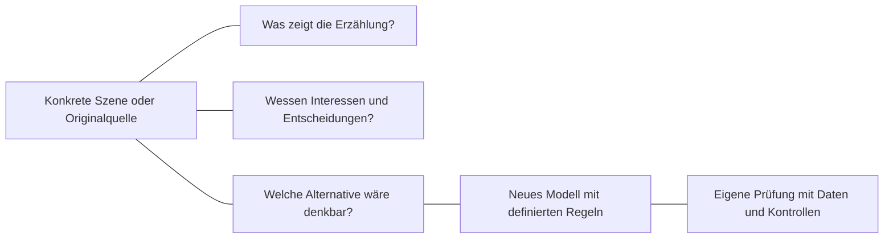

# Loki, Dormammu und Wanda

**HALVETH!!! · Perspektiven, Macht und überprüfbare Modelle**  
[English](HALVETH_MARVEL_PERSPECTIVES.en.md) · [Forschungsraum](../README.md)

Stand der Quellenprüfung: **11. September 2026**. Dies ist eine Literatur- und Erzählanalyse, kein Bericht über beobachtete biologische oder physikalische Effekte. Die Datierung dokumentiert diese Ausarbeitung; sie behauptet keine weltweite Erstentdeckung. Spoiler zu *Thor*, *Doctor Strange*, *WandaVision* und *Loki* Staffel 2.

## Die gemeinsame Frage

Kann man einer Figur zuhören, ihre Herkunft und Bedürfnisse verstehen und zugleich die Freiheit anderer schützen? Die Frage verdient mehr als die Zuordnung „Held“ oder „Monster“. Eine nachvollziehbare Motivation kann eine Handlung erklären; ob die Handlung vertretbar ist, hängt zusätzlich von ihren Folgen, den Betroffenen und möglichen Alternativen ab. Das ist die hier vorgeschlagene ethische Lesart.

## Loki und die verschiedenen Bedeutungen von Herkunft

Marvels Filmprofil beschreibt Loki als Laufeys Sohn. Odin findet ihn als Baby nach dem Kampf auf Jotunheim und zieht ihn in Asgard auf. Abstammung, Erziehung, sichtbare Gestalt und spätere Entscheidungen bilden damit verschiedene Teile seiner Geschichte. Das Profil beschreibt außerdem magische Gestaltwandlung und seine Ausbildung in Zauberei. Es liefert keine biologische Erklärung durch veränderte Chromosomen. Die genaue Ursache seiner menschlich wirkenden Babygestalt bleibt in dieser ausgewerteten Quelle offen. [Marvel, Loki On Screen](https://www.marvel.com/characters/loki/on-screen?mobile-app=true&theme=wiki)

In Staffel 2 bewegt sich Loki durch verschiedene Zeitpunkte. Im Finale wird seine Beziehung zu den Zeitlinien als aktives Halten und Schützen erzählt. Das eröffnet eine Frage nach Verantwortung und Last: Wer erhält Handlungsmöglichkeiten, und wer trägt die Kosten? Es belegt keine reale Zeitnavigation durch Menschen. [Marvel, Tom Hiddleston and the TVA Family, 5. Oktober 2023](https://www.marvel.com/articles/tv-shows/loki-tom-hiddleston-tva-family?cid=EML_Newsletter_2023106_WeeklyPulse_Story1), [Marvel, Natalie Holt on Season 2, 9. November 2023](https://www.marvel.com/articles/tv-shows/loki-composer-natalie-holt-season-2/)

He Who Remains erzählt im MCU von Varianten, Wissensaustausch und einem folgenden multiversalen Krieg. Das ist zunächst die Erklärung dieser Figur innerhalb der Serie. Comicversionen bilden einen eigenen Erzählzusammenhang: Marvel weist ausdrücklich darauf hin, dass der ursprüngliche Comic-He-Who-Remains keine Kang-Variante ist. [Marvel, He Who Remains, 13. Juli 2021](https://www.marvel.com/articles/tv-shows/loki-he-who-remains-jonathan-majors?linkId=124368231), [Marvel, Comicfassung, 20. Juli 2021](https://www.marvel.com/articles/comics/who-is-he-who-remains-in-the-comics?linkId=125034755)

## Dormammu und eine Verhandlung unter Zwang

Im Film *Doctor Strange* will Dormammu die Erde seinem Reich einverleiben. Strange bindet sich und Dormammu mithilfe des Zeitsteins in eine wiederkehrende Begegnung. Dormammu tötet Strange wiederholt; Strange kehrt zurück und bietet denselben Handel an. Die Schleife endet nach der Vereinbarung, die Erde zu verlassen und die Anhänger mitzunehmen. Eine tatsächlich endlos fortgesetzte Folter wird damit nicht gezeigt; die Aussicht auf unbegrenzte Wiederholung ist jedoch das Druckmittel. [Marvel, Doctor Strange On Screen](https://www.marvel.com/characters/doctor-strange-stephen-strange/on-screen?mobile-app=true&theme=dark%2F1000), [offizieller Filmclip, Marvel Entertainment, 27. März 2025](https://www.youtube.com/watch?v=DCrFkaZL254)

**Die ethische Gegenfrage bleibt offen:** Hätte Verständigung ohne diese Zwangslage die Invasion verhindern können? Die geprüften Quellen zeigen keine solche erfolgreiche Alternative. Sie belegen auch nicht, dass Dormammu zum Überleben Dimensionen essen muss oder im Film Mensch werden möchte. Diese Zusatzannahmen müssten an einer konkreten Szene oder Comicstelle geprüft werden.

Für menschliche Gestalt gibt es allerdings einen konkreten Comicbezug: Marvels Clea-Profil beschreibt, dass Dormammu und Umar menschliche Form annehmen und sich in der Dunklen Dimension niederlassen. Derselbe Text beschreibt die Eingliederung weiterer Reiche. Eine angenommene Form ist dabei noch keine menschliche Biologie oder Zustimmung der Bewohner. Die Stelle wurde hier über den indexierten Auszug des offiziellen Profils geprüft; der direkte Vollabruf war nicht verfügbar. [Marvel, Clea In Comics](https://www.marvel.com/characters/clea/in-comics)

Ein alternatives Drehbuch könnte deshalb ein Gespräch über Zugang, Existenzbedingungen, freiwillige Kooperation und Grenzen entwerfen. Es wäre eine neue Fortsetzungsidee, keine nachträglich entdeckte Filmszene. Zuhören und die Verweigerung einer unfreiwilligen Vereinnahmung lassen sich miteinander verbinden.

## Wanda und die rote Magie

Mit der roten Magie ist im hier besprochenen Zusammenhang **Wanda Maximoff, die Scarlet Witch**, gemeint. In *WandaVision* wird ihre Fähigkeit als Chaosmagie benannt. Disneys Rückblick beschreibt sowohl ihre Hilfe als Avenger als auch die Kontrolle über Westview, durch die andere ihre Entscheidungsfreiheit verlieren. Damit lässt sich ihr Konflikt an Handlungen prüfen, statt aus der roten Darstellung eine moralische Eigenschaft abzuleiten. [Disney D23, Wanda Maximoff’s Top 10 MCU Moments, 6. Mai 2022](https://d23.com/wanda-maximoffs-top-10-mcu-moments-so-far/)

Die Comicreihe *Scarlet Witch* von 2023 liefert eine andere Perspektive: Wanda eröffnet einen Ort für Menschen in Not und setzt ihre Chaosmagie gegen eine Bedrohung ein. Das widerspricht einer pauschalen Lesart, nach der diese Figur oder ihre Fähigkeit ausschließlich als feindlich dargestellt würde. Film und Comic werden dabei nicht zu einer einzigen Biografie zusammengefügt. [Marvel, Scarlet Witch 2023](https://www.marvel.com/comics/series/33277/scarlet_witch_%282023_-_present%29)

## Was ein mathematisches Modell leisten könnte

Eine HALVETH-Modellidee kann Zustände, Übergänge, Rückkopplungen, Belastungen und Ausstiegsmöglichkeiten definieren. Dafür braucht sie benannte Variablen, einen Operator, Parameter, Ausgangswerte und beobachtbare Ergebnisse. Der Begriff „Chaosmagie“ wäre dann ein ausdrücklich gewählter Modellname. Seine Verwendung beweist weder Marvel-Kräfte noch eine physische Wirkung.

Mathematische Chaostheorie untersucht unter anderem deterministische, nichtperiodische Dynamik und die Empfindlichkeit gegenüber Anfangsbedingungen. Lorenz veröffentlichte dazu 1963 ein konkretes Differentialgleichungsmodell. Das Wort „Chaos“ allein verbindet ein neues Modell noch nicht mit dessen Ergebnissen. [Lorenz, Deterministic Nonperiodic Flow, 1963, Originalarbeit](https://cdanfort.w3.uvm.edu/research/lorenz-1963.pdf)

Auch die vorgeschlagene Brücke zu Chromosomen und Spin benötigt eigene Definitionen. Chromosomen bestehen aus DNA und Proteinen; DNA-Replikation kopiert genetisches Material vor der Zellteilung. Quantenspin ist eine intrinsische quantenmechanische Größe, keine bloße sichtbare Drehung einer gezeichneten Struktur. Diese Quellen liefern keine Beobachtung eines gemeinsamen Vorwärts- und Rückwärtscodierens aller Lebewesen durch die Raumzeit. [NHGRI, Chromosome](https://www.genome.gov/genetics-glossary/Chromosome), [NHGRI, DNA Replication](https://www.genome.gov/genetics-glossary/DNA-Replication), [MIT, Spin One Half, 2013](https://ocw.mit.edu/courses/8-05-quantum-physics-ii-fall-2013/a56c316e4ec548d8bd0a554fac9a74e8_MIT8_05F13_Chap_02.pdf)

## Vergleich zum Weiterdenken

| Gegenstand | Dokumentierte Grundlage | Offene Gestaltungsfrage |
| --- | --- | --- |
| Loki | Herkunft, Erziehung, magische Gestaltwandlung; spätere Verantwortung für Zeitlinien | Wie bleiben Herkunft und selbst gewählte Rolle unterscheidbar? |
| Dormammu und Strange | Annexion der Erde; Verhandlung durch eine Zeitschleife | Welche freiwillige Alternative könnte beide Existenzinteressen und die Bewohner schützen? |
| Wanda | Hilfe und schädigende Kontrolle in verschiedenen Erzählungen | Wie wird Unterstützung ermöglicht, ohne anderen die Wahl zu nehmen? |
| Mathematisches Modell | Explizite Zustände und Regeln sind formulierbar | Welche zwei Modelle sagen für denselben Test etwas Verschiedenes vorher? |

Die Linien ordnen Prüfbezüge; sie behaupten keine physische Kausalität. Für einen nächsten Modellschritt wären zwei alternative Übergangsregeln, dieselben Startwerte, eine messbare Zielgröße und ein Abbruchkriterium ausreichend, um eine erste konkrete Frage zu untersuchen.

**Mitmachen:** Nenne Werk, Ausgabe oder Szene, die zu einer offenen Frage passt, und erläutere, was sie zusätzlich trägt. Interpretation, eigene Fortsetzungsidee und Messbehauptung bleiben für Leser erkennbar. [Diskussionen](https://github.com/Juri-Halveth/open-research-branches/discussions)

Eigener Text: [CC BY 4.0 gemäß Inhaltslizenz](../LICENSE-CONTENT.md). Namensnennung: **HALVETH!!!**. Verlinkte Marvel-, Disney- und wissenschaftliche Quellen behalten ihre jeweiligen Rechte. Keine Zugehörigkeit zu oder Unterstützung durch Marvel oder Disney behauptet.
