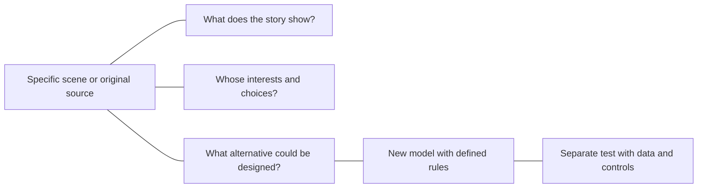

# Loki Dormammu and Wanda

**HALVETH!!! · Perspectives, power and testable models**  
[Deutsch](HALVETH_MARVEL_PERSPECTIVES.de.md) · [Research space](../README.md)

Source review dated **11 September 2026**. This is a literature and narrative analysis, not a report of observed biological or physical effects. The date records this write-up, not a claim to worldwide discovery priority. Spoilers for *Thor*, *Doctor Strange*, *WandaVision* and *Loki* season 2.

## The shared question

Can we listen to a character, understand their background and needs, and protect other people's freedom? A label such as hero or monster does not settle that question. A motive may explain an action; its justification also depends on consequences, affected people and available alternatives. This is the ethical reading proposed here.

## Loki and the meanings of origin

Marvel's screen biography describes Loki as Laufey's son. Odin finds him as a baby after the battle on Jotunheim and raises him in Asgard. Ancestry, upbringing, appearance and later choices are different aspects of that story. The profile also describes magical shapeshifting and training in sorcery. It does not explain these abilities through changed chromosomes. The precise cause of his humanlike appearance as a baby remains unresolved within this reviewed source. [Marvel, Loki On Screen](https://www.marvel.com/characters/loki/on-screen?mobile-app=true&theme=wiki)

Season 2 depicts Loki moving between times and eventually holding and protecting timelines. This invites questions about responsibility: who keeps their choices, and who bears the cost? It does not demonstrate human time travel. [Marvel, Tom Hiddleston and the TVA Family, 5 October 2023](https://www.marvel.com/articles/tv-shows/loki-tom-hiddleston-tva-family?cid=EML_Newsletter_2023106_WeeklyPulse_Story1), [Marvel, Natalie Holt on Season 2, 9 November 2023](https://www.marvel.com/articles/tv-shows/loki-composer-natalie-holt-season-2/)

He Who Remains gives an account of variants, knowledge exchange and a multiversal war. This is initially a character's explanation inside the MCU. Comic continuity needs its own source binding: Marvel explicitly distinguishes the original comic He Who Remains from Kang variants. [Marvel, MCU account, 13 July 2021](https://www.marvel.com/articles/tv-shows/loki-he-who-remains-jonathan-majors?linkId=124368231), [Marvel, comic account, 20 July 2021](https://www.marvel.com/articles/comics/who-is-he-who-remains-in-the-comics?linkId=125034755)

## Dormammu and bargaining under coercion

In *Doctor Strange*, Dormammu intends to annex Earth. Strange uses the Time Stone to bind himself and Dormammu to a recurring encounter. Dormammu repeatedly kills Strange; Strange returns and offers the same bargain. The loop ends after an agreement to leave Earth and take the followers away. The story therefore does not show torture continuing literally forever, although the prospect of unlimited repetition is the leverage. [Marvel, Doctor Strange On Screen](https://www.marvel.com/characters/doctor-strange-stephen-strange/on-screen?mobile-app=true&theme=dark%2F1000), [official film clip, Marvel Entertainment, 27 March 2025](https://www.youtube.com/watch?v=DCrFkaZL254)

**The ethical alternative remains a meaningful question:** could listening have prevented the invasion without that coercion? The reviewed sources do not show a successful version of that alternative. They also do not establish that Dormammu must eat dimensions to survive or wants to become human in the film. Those additional premises need a specific scene or comic passage.

There is a relevant comic reference for human form. Marvel's Clea profile says Dormammu and Umar adopt human form and settle in the Dark Dimension; it also describes annexing further realms. Taking a form does not establish human biology or the inhabitants' consent. This passage was checked through the indexed excerpt of Marvel's official profile; direct full-page retrieval was unavailable. [Marvel, Clea In Comics](https://www.marvel.com/characters/clea/in-comics)

An alternative screenplay could explore access, conditions of existence, voluntary cooperation and boundaries. That would be a new story proposal, not a rediscovered film scene. Listening can coexist with refusing involuntary absorption.

## Wanda and red magic

The red magic discussed here refers to **Wanda Maximoff, the Scarlet Witch**. *WandaVision* identifies her ability as chaos magic. Disney's retrospective includes both her help as an Avenger and her control of Westview, where other people lose their freedom of choice. Actions supply a basis for evaluation; the visual color does not carry a moral verdict. [Disney D23, Wanda Maximoff's Top 10 MCU Moments, 6 May 2022](https://d23.com/wanda-maximoffs-top-10-mcu-moments-so-far/)

The 2023 *Scarlet Witch* comic offers another perspective: Wanda provides help to people in need and uses chaos magic against a threat. It is therefore inaccurate to describe the character or ability as exclusively hostile across all stories. The screen and comic versions remain different continuities. [Marvel, Scarlet Witch 2023](https://www.marvel.com/comics/series/33277/scarlet_witch_%282023_-_present%29)

## Quake: identifying the character with the waves

In *Agents of S.H.I.E.L.D.*, **Chloe Bennet** plays **Skye / Daisy Johnson / Quake**. Marvel describes her power as manipulating vibrations, including creating earthquakes. This identifies a specific character matching the remembered ability. “Quantum waves” is not the explanation given in that character description. [Disney D23, Agents of S.H.I.E.L.D. Spring Preview](https://d23.com/marvels-agents-shield-spring-preview/), [Marvel, The Many Identities of Daisy Johnson, 20 August 2020](https://www.marvel.com/articles/tv-shows/ydk-agents-of-shield-the-many-identities-of-daisy-johnson?linkId=97933204)

## What a mathematical model could do

A HALVETH model proposal can define states, transitions, feedback, burdens and exit options. It needs named variables, an operator, parameters, initial values and observable outcomes. “Chaos magic” would then be an explicitly chosen model name, not proof of Marvel powers or a physical effect.

Mathematical chaos theory studies phenomena including deterministic nonperiodic dynamics and sensitivity to initial conditions. Lorenz published a concrete differential-equation model in 1963. A shared word does not transfer that model's results to a newly named system. [Lorenz, Deterministic Nonperiodic Flow, original paper, 1963](https://cdanfort.w3.uvm.edu/research/lorenz-1963.pdf)

The suggested bridge to chromosomes and spin also needs its own definitions. Chromosomes are made of DNA and proteins; DNA replication copies genetic material before cell division. Quantum spin is an intrinsic quantum property, not simply the visible rotation of a drawing. These sources do not provide an observation of all living beings jointly coding forward and backward through spacetime. [NHGRI, Chromosome](https://www.genome.gov/genetics-glossary/Chromosome), [NHGRI, DNA Replication](https://www.genome.gov/genetics-glossary/DNA-Replication), [MIT, Spin One Half, 2013](https://ocw.mit.edu/courses/8-05-quantum-physics-ii-fall-2013/a56c316e4ec548d8bd0a554fac9a74e8_MIT8_05F13_Chap_02.pdf)

## A comparison for further work

| Subject | Documented basis | Open design question |
| --- | --- | --- |
| Loki | Ancestry, upbringing, magical shapeshifting and responsibility for timelines | How can origin and a chosen role stay distinguishable? |
| Dormammu and Strange | Annexation of Earth; a bargain enforced by a time loop | What voluntary alternative could protect both sides and the inhabitants? |
| Wanda | Help and harmful control across different stories | How can support preserve other people's choices? |
| Mathematical model | Explicit states and rules can be formulated | Which two models predict different outcomes for the same test? |

These lines organize questions; they do not assert physical causation. A first model comparison can bind two transition rules, the same initial values, a measurable outcome and a stopping criterion.

**Contribute:** identify a work, edition or scene relevant to an open question, and explain what it adds. Keep interpretation, proposed continuation and empirical claim recognizable to readers. [Discussions](https://github.com/Juri-Halveth/open-research-branches/discussions)

Original text: [CC BY 4.0 under the content license](../LICENSE-CONTENT.md). Attribution: **HALVETH!!!**. Linked Marvel, Disney and scientific sources retain their respective rights. No affiliation with or endorsement by Marvel or Disney is claimed.
