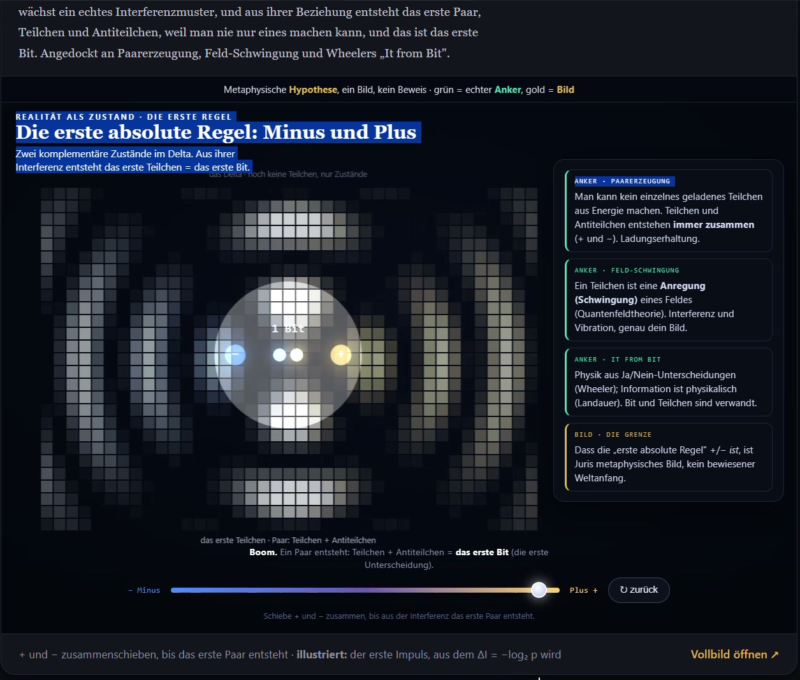
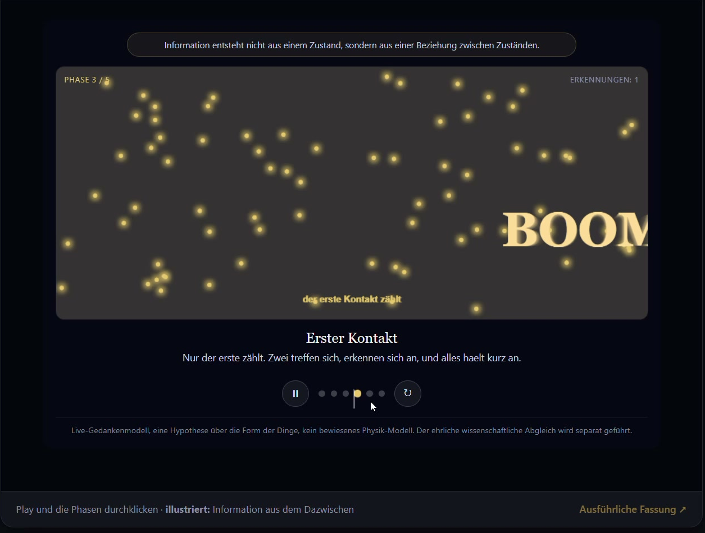
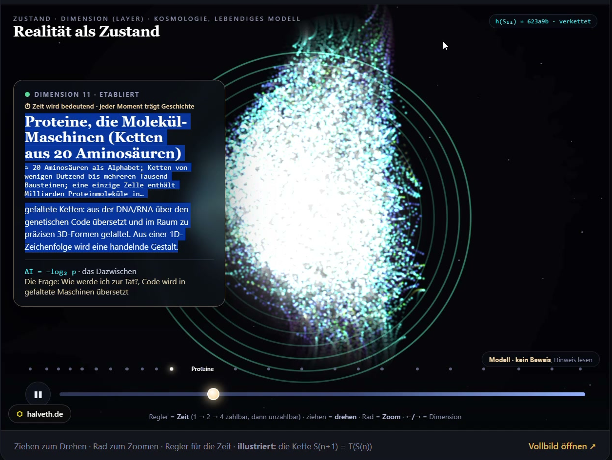
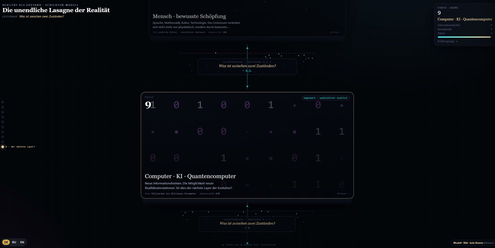

# HALVETH · Modellvideo und Quellmechanismen

Prüfstand: 30.09.2026. Die eigene Bildschirmaufnahme zeigt bedienbare Zustands-, Wellen-, 3D- und Schichtenansichten. Vier Ausschnitte machen diese Softwarebeobachtungen direkt sichtbar. Die später abgerufenen Quellstände erklären mögliche Darstellungsmechanismen.

| Beleg | Medienzeit | Engste belegte Aussage |
| --- | --- | --- |
| Kreis mit „1 Bit“ | 24,533333 s | Beschrifteter Modellzustand ist sichtbar |
| Wellen / BOOM | 39,033333 s | Phasenansicht und Animationsreaktion sind sichtbar |
| 3D-Ebenen | 62,033333 s | Benannte Ebene und räumliche Darstellung sind sichtbar |
| Schichten | 204,366667 s | Schichten- und Zwischenraumansicht ist sichtbar |

Die Zeitangaben sind Präsentationszeiten der Videospur. Sie sind keine kalibrierten Außenereigniszeiten und keine Aussage über den allerersten Übergang der gesamten Aufnahme. Historisch im Browser ausgeführte Bytes und später abgerufene Quellbytes bleiben getrennt.

Beleg öffnen · 1 Bit und die Darstellungsregel

**OBSERVED:** Der Ausschnitt zeigt Kreis und Beschriftung. Im später gesicherten [Plus-/Minus-Quellstand](https://halveth.de/Realitaet_Erste_Regel_Plus_Minus.html) lautet die Zustandsbedingung `realized = (c >= 0.92)`; Kreis und Beschriftung werden im entsprechenden Zeichenpfad erzeugt.

**Gegenmodell:** Eine konfigurierte Darstellungsregel kann den sichtbaren Übergang erzeugen. Für eine zusätzliche physikalische Wirkung wären eine getrennte Messgröße und ein unterscheidender Versuch nötig.

Beleg öffnen · Wellen und zwei BOOM-Pfade

**OBSERVED im späteren Quellstand:** Das [Wellenmodell](https://halveth.de/Realitaet_als_Zustand_Live_Wellenmodell.html) enthält eine Kontaktbedingung `dx*dx + dy*dy < 170` und einen weiteren Aufruf bei `modeT > 5.5` in Modus 3.

Der zweite Pfad ist ein statisches Gegenbeispiel zur Behauptung, diese Quellfassung könne BOOM ausschließlich durch Kontakt auslösen. Welcher Pfad den dargestellten Videoablauf ausgelöst hat, bleibt **UNKNOWN**.

Beleg öffnen · 3D-Ebenen und angezeigter Marker

**OBSERVED:** Vorgegebene Ebenen und Darstellungsvorlagen im [3D-Modell](https://halveth.de/Realitaet_als_Zustand_Livemodell.html) steuern die Ansicht. Der dortige sechsstellige Marker wird mit einer Indexrechnung erzeugt. Er ist keine kryptografische Bindung des vollständigen historischen Welt- oder Modellzustands.

Beleg öffnen · Schichten und vorgegebene Werte

**OBSERVED:** Das [Schichtenmodell](https://halveth.de/Realitaet_Schichten_Modell.html) enthält vorgegebene Ebenendaten. Die Fokusfunktion übernimmt Komplexitäts- und `p`-Werte aus diesen Daten. Ihre Anzeige ist ein Softwarebeleg; die Werte wurden hier nicht als empirisch kalibrierte Wahrscheinlichkeiten gemessen.

Quellbindung, Coverage und fortsetzbare Forschungsfrage

Originalvideo: SHA-256 `29eb0e8de425a35887fbb9e9528f68fda7e507fa369be1d9988335ae3cff8626`, 198.397.715 Bytes, 204,399966 s, 2558 × 1438 Pixel. Visuelle Vorprüfung: 204 Übersichtsbilder, 17 Filmstreifen und sieben weitere gebundene Frames. Die Tonspur wurde nicht geprüft; nicht alle 6.131 Originalframes wurden einzeln visuell geprüft. Capture-Loss und historische Browserbytes bleiben offen.

Die vier veröffentlichten Bilder sind Ausschnitte der eigenen Modelloberfläche. Browserleiste und Desktopumgebung sind entfernt. Ihre exakten Bytes stehen im [öffentlichen Hashregister](HALVETH_PUBLICATION_EVIDENCE_2026-09-30.json).

**Forschungsfrage:** Besitzt ein vorgeschlagener Übergangsraum Ξ eine unabhängig definierte Eigenschaft, die das Schwellenmodell anders vorhersagt? Der nächste sichere Schritt ist ein isoliertes eigenes Modell mit getrennten Records für Reglerwert, Rendering, Beobachtung und Ergebnis. Ein zusätzlicher physikalischer Übergang, externe Vorhersage oder universelle Entdeckung ist durch diesen Prüfstand **NOT_PROVEN**.

Neu verfasste HALVETH-Beiträge: [HALVETH PIRL 2.0](../LICENSE-HALVETH-PIRL-2.0.md). Verlinkte Quellen behalten ihre eigenen Rechte. Mit KI-Unterstützung erstellt und gegen die genannten Quellen geprüft.
