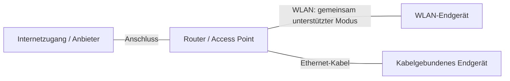

# Wi-Fi 6: Standard, Gerätefähigkeit und aktuelle Verbindung

Stand: 19.09.2026 · HALVETH Research · `FINITE_SNAPSHOT`

## Kurzbefund

**Wi-Fi 6 bezeichnet die bekannte WLAN-Generation IEEE 802.11ax.** Die Zahl
ist eine Generationsbezeichnung. Wi-Fi 6E erweitert die Nutzung auf das
6-GHz-Band. Die IEEE-Fassung 802.11ax-2021 wurde am 9. Februar 2021 genehmigt
und am 19. Mai 2021 veröffentlicht. Die Daten beschreiben diese Standardfassung,
nicht den ersten Verkauf eines Geräts oder die erste Verwendung des Namens.
[IEEE: Standard](https://standards.ieee.org/ieee/802.11ax/7180/),
[IEEE: technische Einordnung](https://technav.ieee.org/topic/ieee-80211ax-standard/).

Eine entsprechende Anzeige auf einem Endgerät ist ein Ansatzpunkt für die
Prüfung von Gerätefähigkeit und Verbindungsmodus. Sie belegt keine neue
Erfindung, keinen Urheber und keine geräteunabhängige Veränderung der Umgebung.

## Drei getrennte Fragen

| Frage | Geeignete Quelle | Aussagegrenze |
| --- | --- | --- |
| Kann der Adapter 802.11ax? | Herstellerdaten und gemeldete Treiberfähigkeiten | Eine Fähigkeit ist noch keine laufende Verbindung. |
| Benutzt die konkrete Verbindung 802.11ax? | Verbindungsdetails des tatsächlich verbundenen Endgeräts | Gilt für dieses Gerät und den Beobachtungszeitpunkt. |
| Welches Gerät sendet, auf welcher Frequenz und mit welcher Leistung? | Gebundene Gerätekonfiguration und passende Funkmessung | Ein Statussymbol ist keine kalibrierte Funkmessung. |

Microsoft nennt einen kompatiblen Router und WLAN-Adapter als Voraussetzungen.
`netsh wlan show drivers` liefert unterstützte Funktypen; `802.11ax` in dieser
Liste gehört zunächst zur Fähigkeit des Adapters/Treibers.
[Microsoft: WLAN in Windows](https://support.microsoft.com/en-us/windows/experience/connectivity-networking/faster-and-more-secure-wi-fi-in-windows).

Samsung beschreibt für unterstützte Modelle ein Symbol für aktives Wi-Fi 6.
Das genaue Symbol und die Bedeutung müssen zum Gerätemodell passen.
[Samsung: Symbole der Statusleiste](https://www.samsung.com/de/support/smartphone-symbole-der-statusleiste/).

## Warum das ohne ein gerade vorgenommenes Update möglich ist

**Bedingte technische Erklärung:** Wenn Router und Endgerät bereits passende,
aktivierte Hardware und Software besitzen, können sie diese Fähigkeit nutzen.
Ein neu vorgenommenes Update ist dafür nicht bei jeder Verbindung erforderlich.
Ob früher eine Installation, Konfigurationsänderung oder ein automatisches
Update stattfand, lässt sich aus dem aktuellen Symbol allein nicht rekonstruieren.

Der Internetanbieter und die lokale Funkstrecke sind getrennte Komponenten.
Der Anbieter kann den Router liefern; ein anderer Tarif ersetzt aber keine
fehlende WLAN-Fähigkeit des Endgeräts.
[Microsoft: Aufbau eines drahtlosen Netzwerks](https://support.microsoft.com/en-us/windows/experience/connectivity-networking/setting-up-a-wireless-network-in-windows).

## Schema: Wo die WLAN-Strecke liegt

Das folgende Bild ist ein allgemeines Funktionsschema. Es ist keine Vermessung
eines konkreten Hauses, kein Paketmitschnitt und keine Zuordnung von Personen.
Kanten bezeichnen mögliche technische Verbindungen, keine historischen Beweise.

Die Funkübertragung benötigt die Funkhardware der beteiligten Geräte. Eine
Anzeige enthält weder ein vollständiges Funksignal noch den Quellcode eines
Senders. Die Untersuchung hier erfasst ausschließlich Betriebssystem-Metadaten.

## Lokaler Befund vom 19.09.2026

Ein eigener Windows-Rechner wurde einmalig mit schreibgeschützten
Betriebssystemabfragen betrachtet. Die öffentliche Zusammenfassung enthält
keine Standortangaben, SSIDs, Netzwerkadressen, Kennwörter oder fremden Geräte.

| Beobachtung | Prüfstand |
| --- | --- |
| Drei `netsh wlan show`-Abfragen liefern die Meldung, dass der WLAN-Konfigurationsdienst nicht ausgeführt wird. | `OBSERVED`: Die Abfragen lieferten keinen WLAN-Verbindungsmodus. |
| Die Dienstabfrage meldet den WLAN-Dienst als gestoppt. | `OBSERVED`: Kein Dienst wurde gestartet oder umkonfiguriert. |
| Die begrenzte Abfrage physischer Netzwerkadapter liefert einen aktiven Ethernet-Adapter mit 2,5 Gbit/s Linkrate. | `OBSERVED`: Das ist die gemeldete lokale Linkrate, keine gemessene Internetgeschwindigkeit. |
| Fähigkeiten und aktueller Modus der anderen Geräte. | `UNKNOWN`: Ihre Verbindungsdetails lagen nicht vor. |
| Ursache und Zeitpunkt einer früheren Änderung. | `UNKNOWN`: Kein Vorher-/Nachher-Protokoll vorhanden. |

Ein in dieser Abfrage nicht gelisteter WLAN-Adapter ist kein vollständiger
Nachweis, dass im Rechner oder in der Umgebung keinerlei WLAN-Hardware existiert.
Ein kabelgebundener Rechner kann gleichzeitig mit einem separat über WLAN
verbundenen Telefon im selben lokalen Netzwerk verwendet werden.

## Kleinster nächster Prüfschritt

1. Routermodell und Modell des Endgeräts benennen.
2. Die Verbindungseigenschaften auf dem betroffenen Gerät ansehen.
3. Einen vom Eigentümer bereitgestellten Screenshot auf das relevante Symbol
   beziehungsweise Protokollfeld beschränken. Netzwerkname, Adressen und andere
   persönliche Inhalte vor Weitergabe entfernen.
4. Die Anzeige mit der passenden Herstellerdokumentation vergleichen.

Dieser Ablauf benötigt keinen Zugriff auf fremde Geräte, keinen Verkehrsmitschnitt
und keine Änderung von Sicherheits- oder Standortberechtigungen. Für eine spätere
Funkmessung wären Gerät, Messgröße, Instrument, Kalibrierung und zulässiger Umfang
eigenständig zu bestimmen.

## Dokumentation und Reichweite

Die lokalen Abfragen wurden mit Zeitfenster, Befehlen, Exitcodes und Dateihashes
gesichert. Ein Hash bindet Dateiinhalte; er ist keine notarielle Beglaubigung und
kein Messnachweis für ein Funksignal. Ein lokaler Zeitstempel ist keine unabhängig
beglaubigte Zeitquelle. Eine notarielle Handlung wurde nicht ausgeführt.

Die Erklärung ist ein begrenzter Standard- und Verbindungscheck. Sie ist weder
eine Sicherheitszertifizierung noch ein Nachweis einer neuen Erfindung.
Wiederaufnahme: konkrete Geräteangaben und eine zugeordnete Verbindungsanzeige.

## English summary

Wi-Fi 6 names IEEE 802.11ax. Hardware capability, an active connection mode and a
calibrated RF measurement are separate evidence levels. The local Windows check
returned a stopped WLAN service and one active Ethernet adapter; it did not
verify another device's Wi-Fi mode. Existing compatible equipment may use Wi-Fi 6
without a newly performed update. No third-party traffic was captured.

All linked primary sources were checked on 19 September 2026.

SPDX-License-Identifier: LicenseRef-HALVETH-PIRL-2.0
