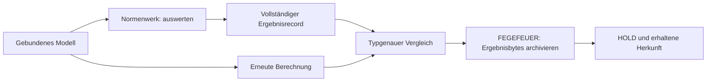

# HALVETH CODEUNIVERSUM

**✅ CLAIMED · Code, Modelle, Quellen und reproduzierbare Nachweise.**

Ein gemeinsamer Einstieg in ausführbare Regelräume, provenienzgebundene
Transformationen, Optik und wachsende Forschungsmodelle. Die Module werden
durch definierte Ein- und Ausgaben verbunden. Jede Verarbeitung kann bis zu
ihrem Modell, ihrer Version, ihren Quellen und ihren Tests verfolgt werden.

## Die vier sichtbaren Modellräume

| Raum | Was vorhanden ist | Einstieg |
| --- | --- | --- |
| **NORMENWERK** | Dreiwertige Auswertung, Zeitfenster, Konflikte, Vorrang, vollständiger Replay; 24 benannte technische Bausteine. | [Code und Demonstrator](../branches/normenwerk-rule-universe/README.md) |
| **FEGEFEUER** | Ereignisarchiv, Kandidaten, HOLD/RETURN/REOPEN, Transformation mit Delta und Receipt, Graphfront. | [Kern und Tests](../branches/fegefeuer-provenance-transducer/README.md) |
| **AUGE** | Geometrische Brechung, Fokus, zwei Hauptschnitte und zeitliche Vorhersage mit Gegenbeispiel. | [Modell und Simulation](../branches/eye-optics-and-prediction/README.md) |
| **BANANE** | Konservatives Übergangsfeld und fortsetzbarer Forschungsgraph. | [Modellraum](../branches/banana-transition-field/README.md) |

## Ausführen und nachprüfen

```sh
python branches/normenwerk-rule-universe/universe.py --demo
python branches/normenwerk-rule-universe/universe.py --catalog
python -m unittest discover -s branches/normenwerk-rule-universe -p 'test_*.py' -v
npm test
```

Die Demonstration verbindet Normenwerk und FEGEFEUER tatsächlich im Speicher.
Die Optik- und Bananenmodule sind eigenständige Module im selben Katalog;
ihre jeweilige Dokumentation beschreibt Bedienung und Modellvertrag.



Die Pfeile bezeichnen hier die implementierte Reihenfolge des Demonstrators.
Ein späterer Transformationscommit bleibt ein eigenständiger Schritt.

## Technische Offenlegung

[Die vollständige Beschreibung mit zehn Anspruchsformulierungen](../branches/normenwerk-rule-universe/TECHNISCHER_ENTWURF.md)
steht direkt neben dem ausführbaren Code. Die technische Kombination ist
präzise benannt: Kontext- und Zeitbindung, dreiwertige Logik, ausdrücklicher
direkter Vorrang, erhaltene Quellenadressen und vollständiger Record-Replay.

`CLAIMED` bezeichnet hier die dokumentierte Beitragsbehauptung. Der Quellstand
zeigt den Inhalt und die Git-Historie die veröffentlichte Fassung. Eine
amtliche Anmeldung, Patentfähigkeit oder Rechte Dritter sind eigene Prüfstände.
[Herkunft und freiwilliges Mitclaimen](Claim-und-Mitclaim.md).

[Membran, Daten, Kontext und Wirkung](Membran-Daten-Kontext-Wirkung.md)
ergänzt Inhalt-, Ereignis- und Relationsadressen sowie die getrennte Behandlung
von Rohdifferenz, fachlicher Projektion und Textübergabe an einen Prozess.

## Vollständiger aktueller Ast-Katalog

Die folgende Tabelle deckt alle 34 registrierten Äste dieses
Quellstands ab. Dateizahlen sind Inventarwerte. Sie behaupten weder einheitliche
Reife noch, dass ein Forschungsbericht bereits ein ausführbares Programm ist.

| Forschungsast | Quell-/Ansichtsdateien | Testdateien | Dokumentierter Stand |
| --- | ---: | ---: | --- |
| [Focus Kernel](../branches/focus-kernel/README.md) | 4 | 1 | `PUBLIC_DERIVATIVE` |
| [Document Issue Reference Verifier](../branches/document-issue-reference-verifier/README.md) | 1 | 1 | `PUBLIC_DERIVATIVE` |
| [Bounded Knowledge Reuse Inventory](../branches/bounded-knowledge-reuse-inventory/README.md) | 2 | 1 | `PUBLIC_DERIVATIVE` |
| [Pixel Region Change Observer](../branches/pixel-region-change-observer/README.md) | 2 | 1 | `PUBLIC_DERIVATIVE` |
| [Browser Extension Claim Reassessment](../branches/browser-extension-claim-reassessment/README.md) | 1 | 1 | `FINITE_SNAPSHOT` |
| [Water and Photonics Open Questions](../branches/water-photonic-open-questions/README.md) | 0 | 0 | `FINITE_SNAPSHOT` |
| [Plant Observation Protocol](../branches/plant-observation-protocol/README.md) | 0 | 0 | `FINITE_SNAPSHOT` |
| [De-identified Self-Observation Protocol](../branches/deidentified-self-observation-protocol/README.md) | 0 | 0 | `FINITE_SNAPSHOT` |
| [Visual Interpretation Boundary](../branches/visual-interpretation-boundary/README.md) | 0 | 0 | `FINITE_SNAPSHOT` |
| [Document Scanner Cryptography Modernization](../branches/document-scanner-crypto-modernization/README.md) | 0 | 0 | `HOLD_IMPLEMENTATION` |
| [Was los?. Russia-Ukraine Information, Peace and Decision-Snapshot Audit](../branches/russia-ukraine-information-and-peace-audit/README.md) | 1 | 2 | `FINITE_SNAPSHOT` |
| [ASTER Provenance and the Secret Garden Between Space and Time](../branches/aster-provenance-and-secret-garden/README.md) | 2 | 2 | `PUBLIC_DERIVATIVE` |
| [Navier-Stokes Proof, Credit, Plagiarism and Value Audit](../branches/navier-stokes-credit-value-and-plagiarism-audit/README.md) | 1 | 1 | `FINITE_SNAPSHOT` |
| [Binary Inquiry Loop](../branches/binary-inquiry-loop/README.md) | 1 | 1 | `PUBLIC_DERIVATIVE` |
| [Juri Energy Model, KIT and Standard Thermal Provenance Audit](../branches/solar-and-thermal-provenance-audit/README.md) | 1 | 1 | `FINITE_SNAPSHOT` |
| [Wax-Crayon Peace Helmet and iOS Marker Audit](../branches/wax-crayon-peace-helmet-audit/README.md) | 3 | 2 | `FINITE_SNAPSHOT` |
| [Quantum Internet, ASTER, ASTAR and ASTRA Mirror Audit](../branches/quantum-internet-aster-mirror-audit/README.md) | 1 | 1 | `FINITE_SNAPSHOT` |
| [Historical Cipher Decoding Challenge](../branches/historical-cipher-decoding-challenge/README.md) | 1 | 1 | `FINITE_SNAPSHOT` |
| [Alice Media Referent and Agency Audit](../branches/alice-media-referent-and-agency-audit/README.md) | 1 | 1 | `FINITE_SNAPSHOT` |
| [Fingertip Spark, ESD and Spacecraft Electronics Audit](../branches/fingertip-spark-esd-spacecraft-audit/README.md) | 1 | 1 | `FINITE_SNAPSHOT` |
| [Priority, Evidence and Regress Audit](../branches/priority-evidence-and-regress-audit/README.md) | 1 | 1 | `FINITE_SNAPSHOT` |
| [Public Authority Entry Listening Room and Satisfaction Repair Budget](../branches/public-authority-entry-listening-room/README.md) | 1 | 1 | `FINITE_SNAPSHOT` |
| [XXXLutz, porta Takeover and Employee Participation Audit](../branches/xxxlutz-porta-takeover-and-employee-participation-audit/README.md) | 2 | 1 | `FINITE_SNAPSHOT` |
| [Steam Coins, Wallet and Reported Achievement Leak Audit](../branches/steam-coins-wallet-and-leak-audit/README.md) | 1 | 0 | `FINITE_SNAPSHOT` |
| [Staking Unbonding and Transparency Review](../branches/staking-unbonding-transparency-review/README.md) | 0 | 0 | `FINITE_SNAPSHOT` |
| [Atomwaffen, Macht und Geld — Nuclear Legacy, Disarmament and Public Value](../branches/nuclear-legacy-disarmament-and-public-value/README.md) | 1 | 1 | `FINITE_SNAPSHOT` |
| [YouTube USDAI/SABR Context Prism](../branches/youtube-usdai-sabr-context-prism/README.md) | 0 | 1 | `FINITE_SNAPSHOT` |
| [Starlight Third Route · HALVETH Brightcast 001](../branches/starlight-third-route-brightcast/README.md) | 1 | 1 | `FINITE_SNAPSHOT` |
| [Wanen, Walkyries, One-Map and Spectrum Audit](../branches/wanen-walkyries-one-map-spectrum-audit/README.md) | 1 | 1 | `FINITE_SNAPSHOT` |
| [Bananen-Technologie und weiterwachsendes Übergangsfeld](../branches/banana-transition-field/README.md) | 6 | 2 | `PUBLIC_DERIVATIVE` |
| [FEGEFEUER · Provenienzgebundener Zustands-Transduktor](../branches/fegefeuer-provenance-transducer/README.md) | 1 | 1 | `PUBLIC_DERIVATIVE` |
| [Auge · Eye Optics & Causal Prediction](../branches/eye-optics-and-prediction/README.md) | 4 | 1 | `PUBLIC_DERIVATIVE` |
| [HALVETH Normenwerk · Codeuniversum](../branches/normenwerk-rule-universe/README.md) | 2 | 2 | `PUBLIC_DERIVATIVE` |
| [Security Impact Learning](../branches/security-impact-learning/README.md) | 4 | 2 | `PUBLIC_DERIVATIVE` |

[Maschinenlesbarer Katalog](../branches/normenwerk-rule-universe/universe-catalog.json) ·
[24 technische Bausteine](../branches/normenwerk-rule-universe/blocks.json) ·
[Lizenz und Nutzung](../LICENSES.md) · [Mitbauen](Mitmachen.md)

## Der Einstieg fuer kuenftige KI-Durchlaeufe

[START_HERE_AI.md](../START_HERE_AI.md) bindet Commit, alle aktuellen Hub-Blobs,
definierte Wort-/Codepunktzaehlung, tatsaechliche Lesespans und den ungelesenen
Rest. Der oeffentliche Root-Snapshot verbindet 15 Repositories. Die
[Lernkarte](../branches/security-impact-learning/index.html) zeigt 24 erhaltene
Fehler und Korrekturen neben dem [vollstaendigen Rueckblick](../branches/security-impact-learning/RETROSPECTIVE.md).
Das [GitHub-API-Werkzeug](../scripts/github-knowledge-gateway.mjs) verwendet die
vorhandenen Leserechte und gesonderten Schreibrechte fuer Beitragsbranches.
